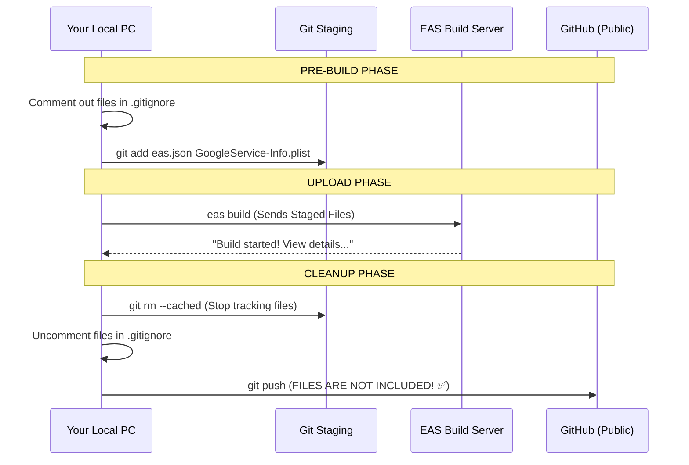

# EAS Build & Security Guide (iOS & Android)

This guide explains how to build your application using **EAS Cloud** while keeping your sensitive keys secure and off GitHub.

## 1. Why EAS Needs These Files
When you run `eas build`, a zip file of your project is sent to an Expo server in the cloud. If a file is in your `.gitignore`, EAS (by default) will **not** send it. 

For a production iOS build, the following files are **mandatory**:

| File Name | Significance & Purpose |
| :--- | :--- |
| **`eas.json`** | Contains your **Environment Variables** (`EXPO_PUBLIC_SUPABASE_KEY`, etc.). Without this, the app will crash because it can't talk to your database. |
| **`GoogleService-Info.plist`**| The "Identity Card" for your iOS app on Firebase. It handles **Push Notifications** and Authentication. Without it, notifications fail. |
| **`google-services.json`** | The Android equivalent of the Plist. Required for Firebase services on Android devices. |

---

## 2. The Security Workflow (Flowchart)

This workflow ensures Expo gets your files, but GitHub **never** sees them.



---

## 3. Step-by-Step Execution Guide

Follow these steps **every time** you build for production:

### Step 1: Prepare the Files
1.  Ensure `eas.json`, `GoogleService-Info.plist`, and `google-services.json` are in your project's root folder.
2.  Open `.gitignore` and add a `#` before these filenames:
    ```gitignore
    # eas.json
    # GoogleService-Info.plist
    # google-services.json
    ```

### Step 2: Stage for Upload
Open your terminal and run:
```bash
git add eas.json GoogleService-Info.plist google-services.json
```

### Step 3: Start the EAS Build
Initiate the build for your platform (e.g., iOS):
```bash
eas build --platform ios --profile production
```
**Wait** until the terminal says: `✔ Uploaded project` or `View build details`.

### Step 4: Security Reset (CRITICAL)
As soon as the upload is confirmed, run this to remove the files from Git's "tracking list":
```bash
git rm --cached eas.json GoogleService-Info.plist google-services.json
```

### Step 5: Restore .gitignore
Remove the `#` from the lines in `.gitignore` so they are ignored again:
```gitignore
eas.json
GoogleService-Info.plist
google-services.json
```

---

## ✅ Summary
By following this methodology, you treat Git like a "conveyor belt" to move files to Expo, then you step off the belt before it reaches GitHub. 

**Result:** A fully functional production app with all secrets kept private.
