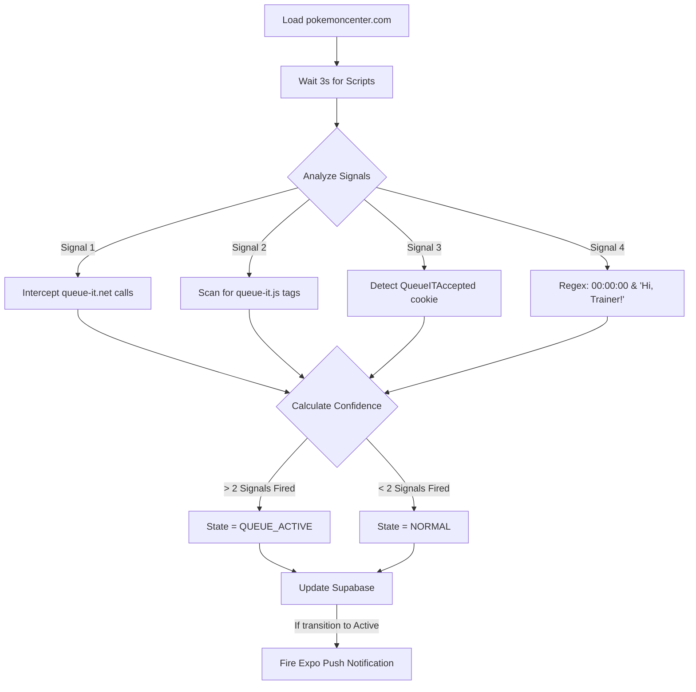

# Pokémon Center Elite Queue Monitor Architecture

This document provides a comprehensive technical overview of the Pokémon Center Queue Monitor feature integrated into the HollowScan ecosystem. 

## 1. System Overview

The system is designed to bypass stringent anti-bot measures (like Imperva) by isolating the detection engine into a dedicated microservice. This microservice maintains a global state in Supabase, which is securely served to premium users via the FastAPI backend, culminating in a real-time, interactive dashboard in the React Native mobile app.

### High-Level Architecture

```mermaid
graph TD
    subgraph Railway [Railway.app - Stealth Microservice]
        Monitor[pokemon_monitor.py<br/>Playwright Stealth Engine]
        Dashboard[Flask/SocketIO<br/>Live Stealth View]
    end

    subgraph Supabase [Supabase Database]
        State[(pc_monitor_state)]
        Events[(pc_queue_events)]
        Subs[(pc_monitor_subscribers)]
    end

    subgraph Backend [Contabo VPS - FastAPI]
        API[/v1/monitor/pokemon-center/status]
        Subscribe[/v1/monitor/pokemon-center/subscribe]
    end

    subgraph Mobile [HollowScan Mobile App]
        UI[PCMonitorHub.js]
        Push[Expo Push Notifications]
    end

    %% Data Flow
    Monitor -- "Writes State (Service Role Key)" --> State
    Monitor -- "Logs Events" --> Events
    Monitor -- "Fires Notifications" --> Push
    Monitor <--> Dashboard
    
    Backend -- "Reads State (Anon Key)" --> State
    Backend -- "Manages Subs" --> Subs
    
    UI -- "Polls every 30s" --> API
    UI -- "Opts in to alerts" --> Subscribe
    Push -- "Triggers Alert" --> UI
    
    classDef secure fill:#e11d48,stroke:#9f1239,stroke-width:2px,color:#fff;
    classDef db fill:#059669,stroke:#047857,stroke-width:2px,color:#fff;
    classDef app fill:#2563eb,stroke:#1d4ed8,stroke-width:2px,color:#fff;
    
    class Monitor secure;
    class State,Events,Subs db;
    class UI,Push app;
```

---

## 2. Component Breakdown

### A. The Stealth Microservice (Railway)
*   **Role**: The isolated detection engine.
*   **Technology**: Python, Playwright, `playwright-stealth`, Flask.
*   **Imperva Evasion**: Strips `navigator.webdriver` flags, injects modern `Sec-Ch-Ua` headers, and uses randomized viewport sizes to mimic a human Windows 10 Chrome user.
*   **Live Dashboard**: Runs a lightweight Flask/SocketIO server on the main thread, broadcasting live JPEG screenshots and system logs to a secure URL.

#### Detection Heuristics Flow


### B. The Database (Supabase)
*   **Role**: The source of truth for monitor state and premium subscriptions.
*   **Row Level Security (RLS)**:
    *   **Write Access**: Exclusively locked to the `service_role` key. Only the Railway microservice can alter the state.
    *   **Read Access**: Open to the `anon` key, allowing the FastAPI backend to securely read the status without exposing write privileges.

### C. The Backend (FastAPI)
*   **Role**: The gatekeeper. Prevents free users from accessing the live state.
*   **Zero-Information Policy**:
    *   The `/status` endpoint checks user premium status.
    *   If **Free**: Returns `{"state": "LOCKED"}` immediately. No database call is made.
    *   If **Premium**: Performs parallel async requests (`asyncio.gather`) to fetch both the global site state and the user's specific `is_subscribed` status to determine UI rendering.

### D. The Mobile App (React Native)
*   **Role**: The user interface (`PCMonitorHub.js`).
*   **State Machine**:
    1.  **LOCKED**: Blurred glassmorphism overlay with a padlock. Tapping redirects to the premium paywall.
    2.  **NORMAL (Unsubscribed)**: Shows "Site Normal" with a prominent blue "Enable Alerts" CTA.
    3.  **NORMAL (Subscribed)**: Shows a breathing green pulse animation and an "Alerts On" badge.
    4.  **QUEUE ACTIVE**: Overrides the UI with a vibrant red gradient, a fast-pulsing animation, and a "JOIN NOW" button linked directly to the Pokémon Center.
*   **Polling**: Silently re-fetches `/status` every 30 seconds.

---

## 3. Fail-Safe Mechanisms

1.  **Smart Key Selector**: The microservice prioritizes the `SUPABASE_SERVICE_ROLE_KEY`. If a network error or permission issue occurs, it logs a warning and automatically falls back to `SUPABASE_ANON_KEY` to attempt a save.
2.  **Idempotent Opt-ins**: The `/subscribe` FastAPI endpoint uses Supabase's `resolution=merge-duplicates`. Rapid repeated taps on the "Enable Alerts" button will not crash the server or bloat the database.
3.  **Alert Cooldowns**: The microservice tracks state transitions. Expo push notifications are only fired exactly when the state flips from `NORMAL` to `QUEUE_ACTIVE`, preventing push-notification spam during network jitter.

## 4. Deployment Instructions

1.  **Backend**: Deploy the updated `app.py` to the Contabo VPS.
2.  **Database**: The `pokemon-center-queue-monitor.sql` schema and RLS policies are fully applied.
3.  **Microservice**: Connect the isolated GitHub repository to Railway.app. Ensure the following variables are set:
    *   `SUPABASE_URL`
    *   `SUPABASE_SERVICE_ROLE_KEY`
    *   `PYTHONUNBUFFERED=1`
