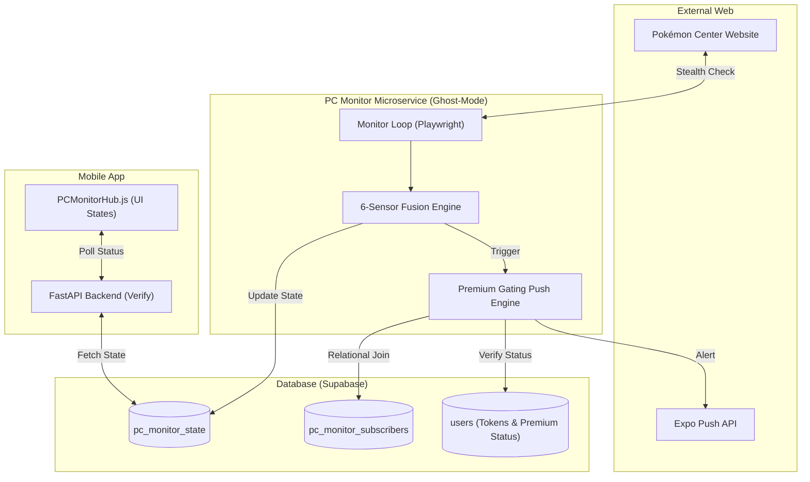
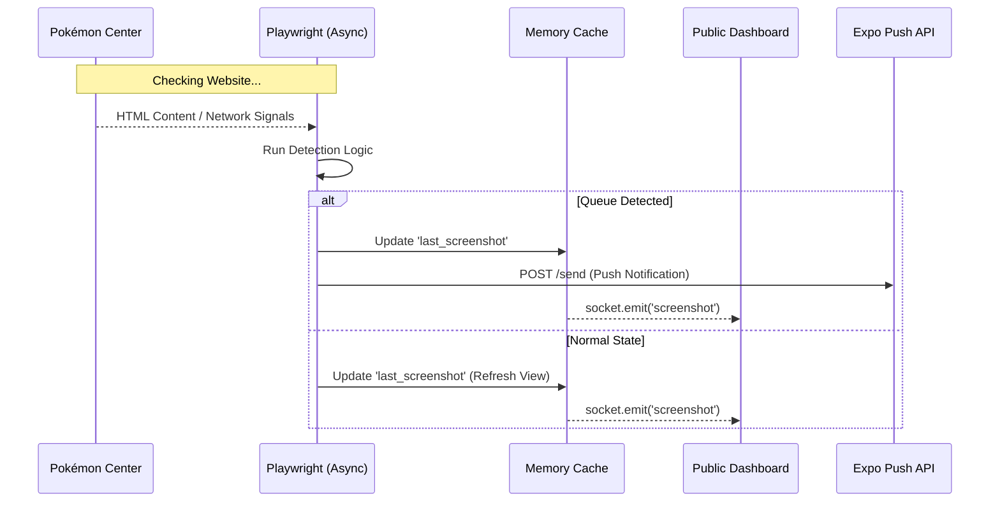

# HollowScan: Pokémon Center Elite Monitor 🛡️🔥
## End-to-End System Architecture & Specification

This document provides a comprehensive technical overview of the **HollowScan Pokémon Center Monitor**, a high-performance, stealth-focused microservice designed to bypass enterprise-grade WAFs (Imperva) and provide real-time intelligence to premium users.

---

## 1. High-Level Architecture

The system is composed of four primary layers working in perfect synchronization:

---

## 2. Working Mechanism: The "Ghost-Mode" Loop

Every 3–5 hours (configurable), the monitor initiates a check cycle. To remain undetected by **Imperva**, it follows a strict isolation protocol.

### Step A: Total Session Isolation & Bandwidth Optimization
1.  **Browser Destruction**: The previous browser instance is completely killed. No cache, no cookies, no local storage persists.
2.  **Proxy Jump**: A new gateway is selected from the 100-node Webshare residential pool for every check.
3.  **⚡ Bandwidth Saver Mode**: To stay within a 1GB/month budget, the monitor **blocks all images and heavy CSS assets** during the scan. This reduces page weight by ~90%, allowing for thousands of checks per month.
4.  **Smart Polling**: Operates on a variable 3–5 hour cycle to maintain a low profile while ensuring daily readiness.

### Step B: Human Behavioral Simulation
To bypass behavioral analysis, the monitor does NOT just load the page. It mimics a human:
*   **Bezier Curves**: Mouse movements follow organic, non-linear paths.
*   **Gaussian Delays**: Wait times between actions are calculated using a normal distribution.
*   **Momentum Scrolling**: The bot scrolls up and down randomly to simulate reading.

---

## 3. The 6-Sensor Detection Engine

The system doesn't just look for "Queue"—it uses a confidence-based fusion of 6 independent sensors:

| Sensor | Description | Weight/Confidence |
| :--- | :--- | :--- |
| **Network Traffic** | Detects background calls to `queue-it.net`. | 100% (Instant Live) |
| **URL Redirect** | Detects `waitingroom` or `queue-it` in the address bar. | 100% (Instant Live) |
| **DOM Heuristics** | Scans for hidden `queue-it.js` or `Challenge_Banner` IDs. | 80% |
| **Cookie Fingerprint** | Detects the `QueueIT` cookie dropped by the WAF. | 60% |
| **Text Keywords** | Intelligent, case-insensitive scan (e.g., "Virtual Queue"). | 40% |
| **Regex Timer** | Detects digital or text countdowns (e.g., `00:05:00`). | 40% |

---

## 4. Resilience & The Notification Pipeline

We ensure that **Zero Alerts** are leaked to non-premium or expired users through a real-time Relational Join.

### **Detection to Notification Flow**

### **The "50-Retry" Resilience Protocol**
If Imperva blocks an IP, the monitor doesn't give up. It applies a **15-second penalty cooldown**, rotates the proxy, and tries again. It will repeat this up to **50 times** per cycle. This ensures that even during high-traffic "Ban Waves," the monitor eventually breaks through to get the data.

---

## 5. User Scenarios

### Scenario 1: The Free User
*   **Mobile App**: The `PCMonitorHub` sees the user is not premium. It displays a blurred "LOCKED" card with a padlock. 🔒
*   **Result**: The user is encouraged to upgrade but sees zero queue intelligence.

### Scenario 2: The Premium User
*   **Mobile App**: Subtitle confirms *"Monitoring 24/7 • Site Normal"*.
*   **Alert**: The moment a queue hits, they receive a push notification on all their devices.
*   **Action**: They click the "JOIN" button and are taken directly to the Pokémon Center waiting room.

---

## 6. System Health & Maintenance

*   **Persistent Dashboard**: Uses a server-side memory cache (Socket.io) to store the `last_screenshot` and `recent_logs`. Stakeholders opening the link see the latest data **instantly** without triggering a new, expensive scan.
*   **Auto-Healing**: If the monitor hits the 50-retry limit without success, it enters an emergency sleep mode to protect the proxy pool and bandwidth.
*   **Confidence Threshold**: `is_active` is only triggered if **2 or more sensors** fire simultaneously, ensuring near-zero false alarms.
