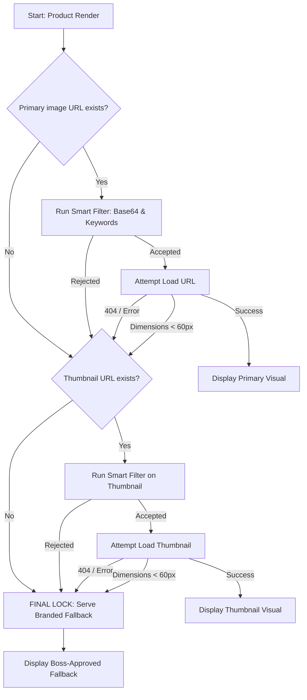

# HollowScan Image Architecture 

This document details the professional, self-healing image sourcing pipeline for the HollowScan mobile application.

## 1. The Core Logic Flow
The app uses a quad-lock hierarchy to ensure that **no product ever appears without a high-quality image.**



## 2. Technical Implementation Details

### A. The "Smart Filter" Engine
To maintain a premium aesthetic, we use a frontend-driven filter to block low-quality artifacts from retailers (especially Smyths and Argos).

1. **Base64 Blocking**: Automatically rejects URLs starting with `data:image`. This permanently eliminates the common "Next.js blurry gradients" often captured by scrapers.
2. **Keyword Filtering**: Rejects URLs containing confirmed junk strings:
   - `placeholder`, `noimage`, `notfound`, `comingsoon`, `unavailable`, `no-photo`.
   - *Note: We intentionally allow `default`, `blur`, and `pixel` to avoid blocking legitimate high-res links from brands like Nike.*

### B. Physical Dimension Enforcement
Even if a URL passes the filter, the image may still be a tiny, stretched placeholder. 

- **Check**: In the `onLoad` event of the `Image` component, we measure the physical pixels.
- **Threshold**: Any image with `width < 60` or `height < 60` is rejected. 
- **Rationale**: A real product image or thumbnail is always at least 150px. Microscopic placeholders are typically 8px to 32px.

### C. The "Zero-Failure" Fallback
To prevent Android build failures (AAPT compilation errors), we avoid using local image assets for placeholders. Instead, we use a **Permanent GitHub Raw URL**.

- **Source File**: `public/no_image.png` (Root directory)
- **Code Reference**: `FALLBACK_IMAGE_URL` from `../constants/Assets.js`
- **URL**: `https://raw.githubusercontent.com/joshuatochinwachi/HollowScan-Mobile-App/main/public/no_image.png`

## 3. List Recycling Hardening
In `HomeScreen` and `SavedScreen`, we use `useEffect` to reset the `imageError` state whenever a card is reused for a new product.

```javascript
// Prevents recycled cards from showing errors from the previous item
useEffect(() => {
    setImageError(false);
}, [item.id]);
```

## 4. Visual Standards
- **Scaling**: All images (Real or Fallback) use `resizeMode="contain"`.
- **Clipping**: ZERO clipping. The full product is always visible.
- **Symmetry**: Fallback images are centered within the white card containers.
