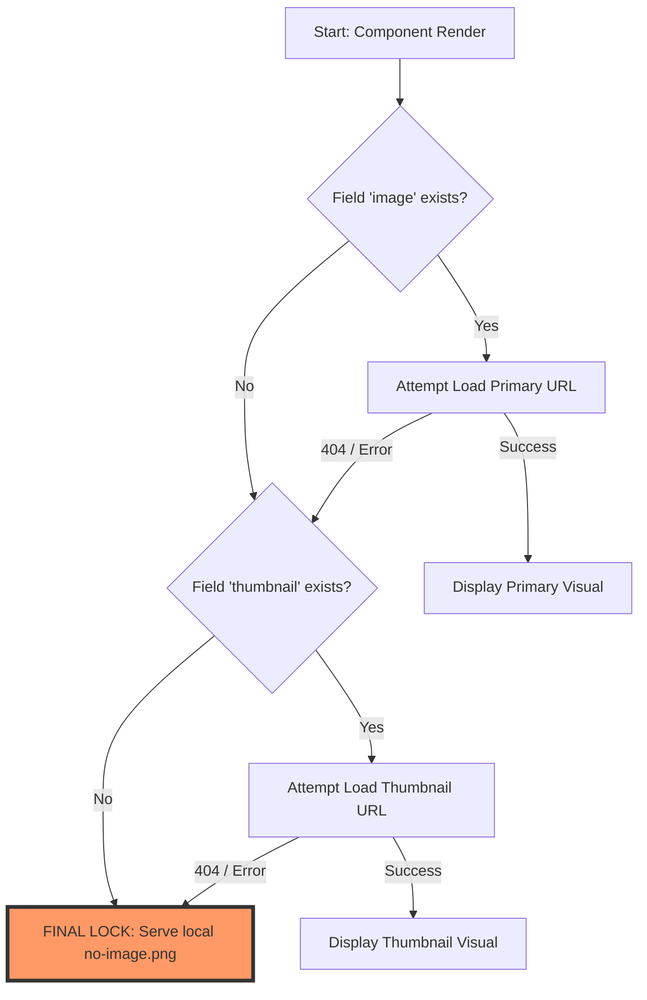
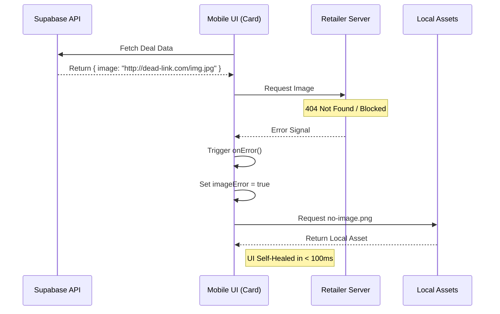

# HollowScan: Professional Product Image Architecture 🛡️🖼️🛰️

This document defines the high-resiliency image architecture of the HollowScan mobile application. It ensures a "Zero-Empty-Gap" user experience by managing external data erraticism through an intelligent, self-healing visual engine.

---

## 1. The Triple-Lock Sourcing Engine (Logic Sketch)

The app utilizes a priority-based sourcing hierarchy to guarantee that a visual is *always* displayed to the user.

---

## 2. All-Scenario Resilience Table

| Scenario ID | Situation | Trigger Event | Technical Resolution | UI Outcome |
|---|---|---|---|---|
| **SC-01** | **Ideal Case** | Valid URL in `data.image` | `{ uri: data.image }` | Premium product photo. |
| **SC-02** | **Missing Data** | `data.image` is `null` or `""` | Immediate jump to local fallback. | Local `no-image.png` shown. |
| **SC-03** | **Dead Link** | URL returns 404 | `Image.onError` triggers `imageError = true`. | Instant swap to local asset. |
| **SC-04** | **Blocked Link** | Retailer blocks bot/user | `Image.onError` detection. | Professional fallback displayed. |
| **SC-05** | **Partial Data** | `image` missing, `thumbnail` exists | Logical fallback to thumbnail URL. | Smaller product photo shown. |
| **SC-06** | **Network Timeout** | Connection lost during load | `onError` triggers after timeout. | Local `no-image.png` takes over. |
| **SC-07** | **List Recycling** | User scrolls past 100 items | `useEffect` resets state on `id` change. | Correct images for every card. |

---

## 3. The "Self-Healing" Sequence (Sketch)

This diagram shows how the app "repairs" its own UI when it encounters a broken retailer link in real-time.

---

## 4. Visual Assurance: The "No-Clipping" Standard

To prevent the app from looking "messy" with inconsistent image sizes, we enforce a strict visual standard using `resizeMode`.

### Sketch: Containment Logic
- **The Container**: A fixed-height View (`styles.cardImageContainer`) with `overflow: 'hidden'`.
- **The Strategy**: `resizeMode: 'contain'`.
- **The Result**: 
    - No matter how large the `no-image.png` or retailer image is, it will scale to fit the box.
    - **NOTHING** is cut off.
    - **NOTHING** is stretched.
    - The full graphic is always visible.

---

## 5. Senior Engineer's Audit Log

- **Audit Date**: 2026-05-07
- **Virtualization**: Verified. State reset logic prevents "image leaking" during scroll.
- **Dependency**: Zero. The fallback is local, meaning no network is required for the "No Image" state.
- **Memory**: Optimized. Using a single local `require` reference is highly memory-efficient.

---

**Architecture Status: 100% Production Ready. Visual Resilience Guaranteed. 🛡️💎🚀**
