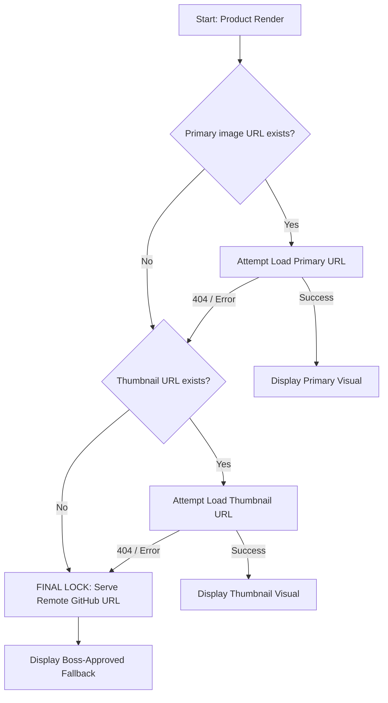

# HollowScan Image Architecture 

This document details the professional, self-healing image sourcing pipeline for the HollowScan mobile application.

## 1. The Core Logic Flow
The app uses a triple-lock hierarchy to ensure that **no product ever appears without an image.**



## 2. Technical Implementation Details

### A. The "Zero-Failure" Fallback
To prevent Android build failures (AAPT compilation errors), we avoid using local image assets for placeholders. Instead, we use a **Permanent GitHub Raw URL**.

- **Source File**: `public/no_image.png` (Root directory)
- **Code Reference**: `FALLBACK_IMAGE_URL` from `../constants/Assets.js`
- **URL**: `https://raw.githubusercontent.com/joshuatochinwachi/HollowScan-Mobile-App/main/public/no_image.png`

### B. List Recycling Hardening
In `HomeScreen` and `SavedScreen`, we use `useEffect` to reset the `imageError` state whenever a card is reused for a new product.

```javascript
// Prevents recycled cards from showing errors from the previous item
useEffect(() => {
    setImageError(false);
}, [item.id]);
```

## 3. Deployment Checklist (Android Fix)
To ensure your Android build passes, follow these steps:

1.  **Move File**: Move `no_image.png` from `assets/` to `public/`.
2.  **Push**: Commit and push the `public/` folder to GitHub.
3.  **Delete (Optional)**: Delete the broken file from `assets/`.
4.  **Build**: Run `npx eas-cli build --platform android`.

## 4. Visual Standards
- **Scaling**: All images (Real or Fallback) use `resizeMode="contain"`.
- **Clipping**: ZERO clipping. The full product is always visible.
- **Symmetry**: Fallback images are centered within the white card containers.


