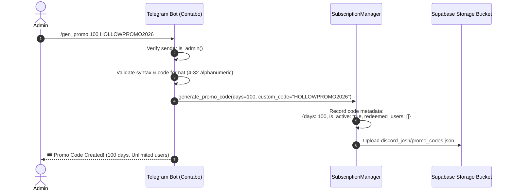
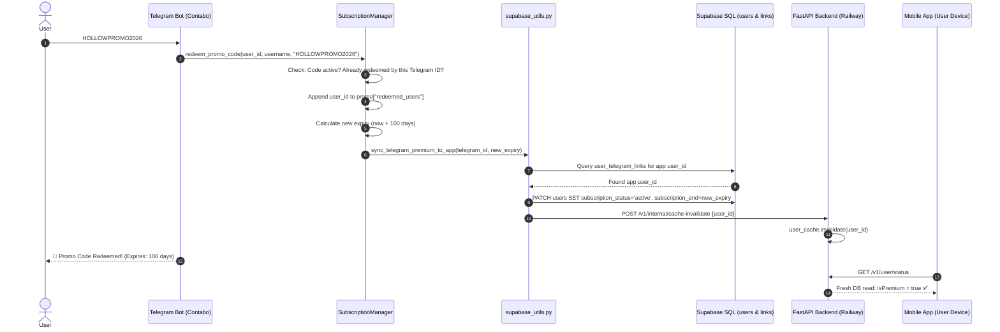
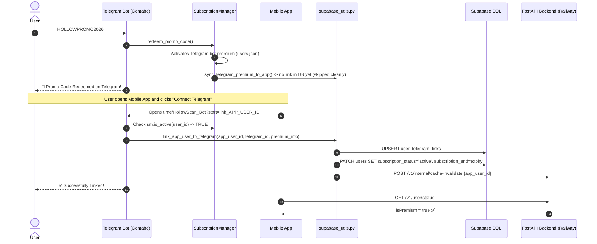

# HollowScan Promo & Multi-Use System — Architecture, Behavior & Deployment Guide
 
> **Status:** Fully Audited, Code Verified, Zero Database Migrations Required.

---

## 1. Executive Summary & Core Guarantees

1. **Do you need to touch or migrate the database?**
   * **NO.** Absolutely **zero database table changes, schema migrations, or manual SQL queries are required**.
   * The SQL tables `users` and `user_telegram_links` already exist in Supabase and have the required columns (`subscription_status`, `subscription_end`, `subscription_source`).
   * The promo codes themselves are managed through the bot's existing storage engine: persisted directly to Supabase Storage (`SUPABASE_BUCKET/discord_josh/promo_codes.json`) with an automatic local fallback file at `data/promo_codes.json`.
2. **Is existing functionality touched?**
   * **NO.** The existing admin `/gen <days>` command is **100% untouched** and retains its original single-use logic.
   * Standard subscription billing (Stripe, Google Play Billing, Apple IAP) is **100% untouched**.
3. **What is new?**
   * **Admin Commands:** `/gen_promo <days> [CODE]`, `/list_promos`, `/revoke_promo <code>`.
   * **Multi-Use Redemption:** Unlimited unique users can redeem the same promo code once each.
   * **Instant Cache Invalidation:** When a Telegram user gains premium (or links a premium Telegram account), the bot notifies the FastAPI backend on Railway (`POST /v1/internal/cache-invalidate`) so the user's mobile app sees `isPremium: true` immediately without waiting for cache expiration.

---

## 2. Storage Isolation: Why There Is Zero Conflict with One-Time Codes

To guarantee that your existing `/gen` system is completely isolated and never affected, the promo code system uses **two entirely separate data stores**:

| Property | Single-Use Codes (`/gen <days>`) | Multi-Use Promo Codes (`/gen_promo <days> [CODE]`) |
|---|---|---|
| **Python Memory Store** | `self.codes` | `self.promo_codes` |
| **Supabase Remote File** | `discord_josh/codes.json` | `discord_josh/promo_codes.json` |
| **Local Fallback File** | `data/codes.json` | `data/promo_codes.json` |
| **Data Format** | `"CODE": days` *(simple key-value)* | `"CODE": { "days": X, "redeemed_users": [...], "is_active": true }` |
| **Redemption Action** | **Deleted immediately** (`self.codes.pop(code)`) so nobody else can ever use it. | **Retained permanently**. User's Telegram ID is appended to `redeemed_users`. Code remains alive for the next user. |
| **Admin Commands** | `/gen <days>` | `/gen_promo <days> [CODE]`, `/list_promos`, `/revoke_promo <CODE>` |

### How the Bot Handles Incoming Codes Without Conflict:
When any user types a code into Telegram (e.g. `HOLLOWPROMO2026` or a random hex code `A1B2C3D4`):
1. **First Check (Single-Use):** The bot queries `self.codes`.
   - If it is a one-time code: it redeems it and removes it from `codes.json`. Finished.
2. **Second Check (Multi-Use Promo):** If it was NOT in `self.codes`, it checks `self.promo_codes`.
   - If it matches an active promo code:
     - The bot checks `if user_id in promo["redeemed_users"]`.
     - If the user already used it $\rightarrow$ tells them: *"⚠️ You have already redeemed this promo code."*
     - If the user has NOT used it $\rightarrow$ adds their ID to `redeemed_users`, calculates their expiration date, activates their premium, and saves to `promo_codes.json`.
     - The code **stays in the database** so the next person can use it too!

---

## 3. How the Number of Days & Expiration Work

When you run `/gen_promo 100 HOLLOWPROMO2026`:
- `100` is the **duration of premium access** granted to each person who redeems it.
- **Each user gets their own independent countdown timer:**
  - If **User A** redeems on September 8 $\rightarrow$ User A's premium expires after 100 days (December 17).
  - If **User B** redeems on October 1 $\rightarrow$ User B's premium expires after 100 days (January 9).
  - If a user already had 10 days remaining on their subscription $\rightarrow$ it automatically extends to `10 + 100 = 110 days`.
- **How long does the promo code itself stay valid?**
  - The promo code stays active for unlimited users until you decide to turn it off.
  - If you ever want to close the campaign so no new users can redeem it, simply type:
    ```
    /revoke_promo HOLLOWPROMO2026
    ```
  - Revoking the code stops any new user from redeeming it, while all users who already redeemed it keep their full 100 days of access!

---

## 4. Infrastructure & Multi-Repo Mapping

```mermaid
flowchart TD
    subgraph Contabo ["Contabo VPS (Repo: dc_scrape)"]
        TB["Telegram Bot (telegram_bot.py)"]
        SM["SubscriptionManager"]
        SU["dc_scrape/supabase_utils.py"]
        TB --> SM
        SM --> SU
    end

    subgraph Storage ["Supabase Cloud"]
        BUCKET[("Storage Bucket: discord_josh/\n• promo_codes.json\n• users.json\n• codes.json")]
        DB[("PostgreSQL Tables:\n• users\n• user_telegram_links")]
    end

    subgraph Railway ["Railway (Repo: HollowScan-Fast-API-Backend)"]
        API["FastAPI (backend/app.py)"]
        CACHE[("In-Memory User Cache\n(TTL: 60s)")]
        API --> CACHE
    end

    subgraph Mobile ["Mobile App (Repo: HollowScan-Mobile-App)"]
        APP["React Native / Expo App"]
    end

    SM <-->|Upload/Download JSON state| BUCKET
    SU -->|1. SELECT user_telegram_links\n2. PATCH users table| DB
    SU -.->|3. POST /v1/internal/cache-invalidate\n(Optional immediate cache bust)| API
    APP -->|Polls /v1/user/status| API
    API -->|Reads profile/status| DB
```

---

## 5. How It Works (Step-by-Step Flowcharts)

### Flow A: Admin Generates a Multi-Use Promo Code
Command: `/gen_promo 100 HOLLOWPROMO2026`



---

### Flow B: User Flow 1 — Linked Account Redeems Promo
User is already connected on the mobile app, then types the promo code into Telegram.



---

### Flow C: User Flow 2 — User Redeems Promo BEFORE Linking Account
User receives the code on Telegram first, redeems it, and links their mobile app afterwards.



---

## 6. All Possible Outcomes & Edge Cases

| Scenario | Input / Action | System Behavior | User Feedback |
|---|---|---|---|
| **Valid Code** | User sends active code | • Grants `days`<br/>• Extends existing active subscription or starts fresh<br/>• Marks user in `redeemed_users`<br/>• Syncs to Supabase SQL & busts Railway cache | `🎉 Promo Code Redeemed!` with expiry date and days remaining |
| **Duplicate Redemption** | User sends the same promo code a second time | • Rejection block triggers<br/>• No changes to subscription or expiry | `⚠️ Already Redeemed: Each user can only redeem a promo code once.` |
| **Revoked Code** | Admin ran `/revoke_promo <code>`, user attempts redemption | • Rejection block triggers<br/>• Preserves past redemption history | `🚫 Promo Expired: This promo code is no longer active.` |
| **Invalid Code** | User sends typo or non-existent code | • Checks single-use table, then promo table<br/>• Neither matches | Falls through to default bot command guidance or error message |
| **Bot Restart / Redeploy** | Bot restarts on Contabo | • On startup, downloads `discord_josh/promo_codes.json` from Supabase Storage<br/>• If offline, reads `data/promo_codes.json` fallback | Zero data loss. All active promo codes and redemption logs persist. |
| **Missing `BACKEND_URL`** | Bot environment lacks `BACKEND_URL` | • `supabase_utils.py` catches missing URL cleanly<br/>• DB is updated directly<br/>• App updates automatically after natural 60s cache TTL | Transparent fallback, zero errors or crashes. |
| **Railway Backend Down/Slow** | Network timeout during cache invalidation | • 5-second timeout with `try/except`<br/>• Bot does not hang; continues smoothly | Non-fatal warning in bot logs; user still gets premium in DB. |

---

## 7. Deployment Checklist

### A. Contabo Deployment (`dc_scrape` repo)
1. **Commit & push** the changes in `dc_scrape/`:
   * `dc_scrape/telegram_bot.py`
   * `dc_scrape/supabase_utils.py`
2. **Environment Variable (Optional for instant cache bust):**
   In the bot's runtime environment (e.g. `.env` or systemd service on Contabo):
   ```env
   BACKEND_URL=https://your-fastapi-backend.up.railway.app
   ```
   *(The bot uses its existing `SUPABASE_KEY` as the shared auth header `X-Internal-Key`).*
3. **Restart the Telegram Bot process** on Contabo.

### B. Railway Deployment (`HollowScan-Fast-API-Backend` repo)
1. **Commit & push** the changes in `backend/app.py`:
   * Includes `POST /v1/internal/cache-invalidate`.
2. **Environment Variable:**
   * Ensure `SUPABASE_KEY` is present in Railway environment variables (it is already used across the backend).
3. **Railway deploys automatically** on push.

### C. Database (Supabase)
* **ACTION REQUIRED:** **NONE.** No migrations, no new tables, no configuration changes.

---

## 8. Summary of Verification

```
[Telegram Bot Admin Command]  --> /gen_promo 100 HOLLOWPROMO2026  --> ✅ Verified
[Telegram Bot Redemption]     --> Handles multi-user, 1x per user --> ✅ Verified
[Single-Use /gen Command]     --> 100% untouched                  --> ✅ Verified
[Storage & Persistence]       --> Supabase Storage + local cache  --> ✅ Verified
[Database Sync]               --> user_telegram_links + users     --> ✅ Verified
[FastAPI Cache Invalidation]  --> Authenticated internal endpoint  --> ✅ Verified
```
