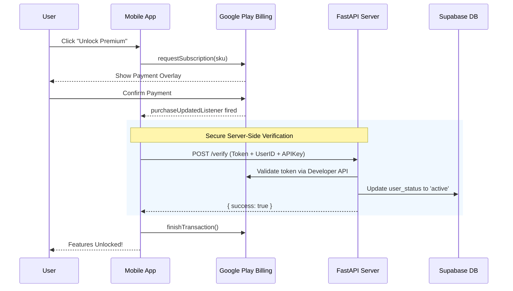
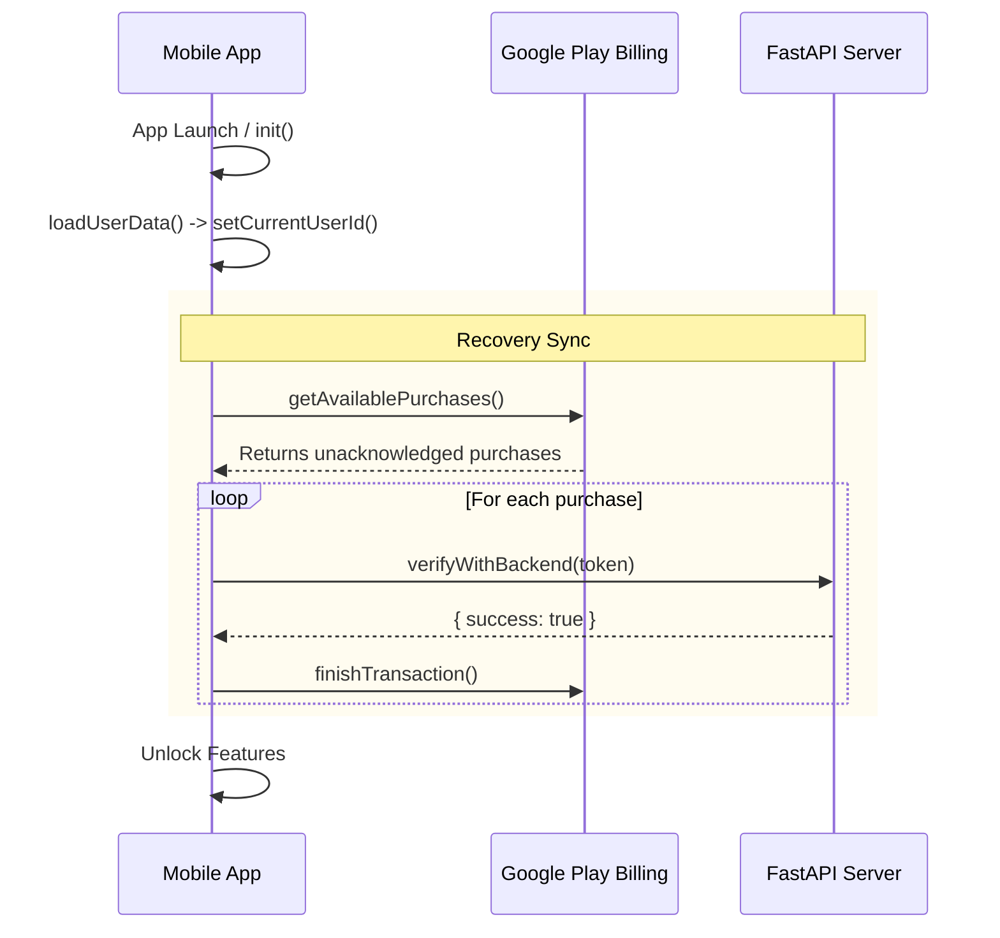

# HollowScan Mobile App - Live on [Google (Android) PlayStore](https://hollowscan.com/android) and [Apple (iOS) App Store](https://hollowscan.com/ios)

**HollowScan** is a powerful mobile arbitrage tool that helps users discover underpriced products across multiple regions (US, UK, Canada) for resale profit. Built with React Native and Expo, the app provides real-time deal scanning, Telegram integration, and premium subscription features.

---

## ✨ Features

### Core Functionality
- **Real-Time Deal Scanning**: 24/7 automated scanning across major retailers.
- **Multi-Region Support**: Browse deals from USA, UK, and Canada stores.
- **Product Categories**: Electronics, Fashion, Home & Garden, Sports, Toys, and more.
- **Price Tracking**: Live price updates and "Check on Site" verification.
- **Saved Products**: Bookmark deals for later review.

### Premium Features
- **Unlimited Access**: Remove daily viewing limits.
- **Priority Alerts**: Get notified of high-value deals first.
- **Telegram Integration**: Sync premium status and receive push notifications via Telegram bot.
- **Cross-Platform Sync**: Premium status syncs between mobile app and Telegram.

### User Experience
- **Dark/Light Mode**: Fully customizable theme preferences.
- **Profile Customization**: Avatar selection and account management.
- **Email Verification**: Secure account management.
- **Deep Linking**: Seamless navigation from external sources.

---

## 🏗️ Tech Stack

### Frontend
- **Framework**: React Native (Expo SDK 54)
- **Navigation**: React Navigation (Bottom Tabs + Native Stack)
- **State Management**: React Context API
- **UI Library**: Custom-built with `expo-blur` and `expo-linear-gradient`

### Backend Integration
- **API**: FastAPI (Python) for business logic and data orchestration.
- **Database**: Supabase (PostgreSQL) for user data and transaction logs.
- **Intelligence**: Discord Archiver/Scraper for real-time deal ingestion.

[Backend (FAST API) Github Repo](https://github.com/joshuatochinwachi/HollowScan-Fast-API-Backend) || [Telegram Bot, Flask API and Discord Archiver Github Repo](https://github.com/joshuatochinwachi/dc_scrape)

---

## 🛡️ Engineering Excellence & Security

### Architectural Principles
- **Service-Oriented Logic**: Business logic is decoupled from UI components into dedicated `services/` (e.g., `SubscriptionService`, `LiveProductService`), ensuring high testability.
- **Centralized State Management**: Optimized use of the **React Context API** to manage authentication and user profiles globally.
- **Custom Hook Pattern**: Utilizes custom hooks to encapsulate complex device interactions, keeping components clean and declarative.

### Security Standards
- **Authenticated Proxy Architecture**: Backend requests are proxied via Supabase-style verified headers, preventing direct database exposure.
- **Secure Persistence**: Sensitive session data is handled with lifecycle-aware state management, with local tokens stored securely via `AsyncStorage`.
- **Environment Isolation**: Production secrets (API keys, project IDs) are managed via `eas.json` and `.env.local` to ensure Zero-Trust configuration.

### Performance & UI/UX
- **Dynamic Theming**: First-class support for **System Dark/Light Mode** with smooth transitions.
- **Optimized List Rendering**: Implementation of `FlatList` optimizations and skeleton loaders to maintain 60FPS.
- **Premium Aesthetics**: Use of glassmorphism and custom gradients for a high-end feel.

---

## 📂 Project Structure

```text
hollowscan_app/
├── android/                         # Android native source and configuration
│   └── app/
│       ├── build.gradle
│       └── google-services.json
├── App.js                           # Root application component & navigation stack
├── assets/                          # App branding, icons, and static images
├── components/                      # Shared UI components
│   ├── DailyLimitModal.js           # Premium limitation and countdown interface
│   └── InfoModal.js                 # General-purpose alert and info modals
├── context/                         # Global state management (Context API)
│   └── UserContext.js               # Central store for Auth, User Profile, and Premium status
├── Constants.js                     # Centralized API and branding configuration
├── eas.json                         # EAS Build profiles (Production key management)
├── index.js                         # React Native entry point
├── package.json                     # Dependency manifest and build scripts
├── screens/                         # Feature-specific screen components
│   ├── HomeScreen.js                # Core deal discovery and scanning interface
│   ├── ProductDetailScreen.js       # Detailed product views and external store links
│   ├── ProfileScreen.js             # User account and subscription management
│   ├── TelegramLinkScreen.js        # Telegram BOT pairing and sync interface
│   └── VerificationScreen.js        # Email/OTP account verification logic
├── services/                        # Business logic & external API integrations
│   ├── LiveProductService.js        # Real-time product data orchestration
│   ├── NavigationService.js         # Ref-based navigation for background events
│   ├── PushNotificationService.js   # Expo-based push alert handling
│   └── SubscriptionService.js       # IAP controller (verified Fixes 1, 2, 3 applied)
└── utils/                           # Shared utility functions
    └── format.js                    # Text processing and currency formatting
```

### 📚 Key Documentation Guides
- **[DEPLOYMENT_GUIDE.md](./DEPLOYMENT_GUIDE.md)**: Production release and store submission workflow.
- **[TELEGRAM_INTEGRATION_GUIDE.md](./TELEGRAM_INTEGRATION_GUIDE.md)**: Logic for syncing mobile accounts with the bot.
- **[ARCHITECTURE_DIAGRAM.md](./ARCHITECTURE_DIAGRAM.md)**: In-depth technical system design.
- **[DEEP_LINKING_GUIDE.md](./DEEP_LINKING_GUIDE.md)**: Protocol-based application navigation.

---

## 💳 Premium Subscription & IAP Architecture

The application implements a robust, cross-platform In-App Purchase (IAP) system designed for maximum reliability.

### 1. High-Level Technical Architecture
- **IAP Client**: `react-native-iap` (v14+) for Google Play and Apple App Store.
- **Backend Verification**: Python (FastAPI) server using `google-api-python-client`.
- **Persistence**: Supabase for transaction history and user status tracking.

### 2. Transaction Workflow (Google Play)



### 3. Startup Recovery Flow (Fix 3)
*Handles purchases that were paid for but prevented by network/app crashes.*



---

## 🚀 Getting Started

### Prerequisites
- Node.js 16+ and npm
- Expo CLI: `npm install -g expo-cli`

### Installation
1. `git clone <repository-url>`
2. `cd hollowscan_app`
3. `npm install`
4. `npx expo start`

---

## 📦 Deployment

See [DEPLOYMENT_GUIDE.md](./DEPLOYMENT_GUIDE.md) for full instructions:
```bash
# Production building
eas build --platform all --profile production
```

---

**Built with ❤️ for arbitrage enthusiasts**
