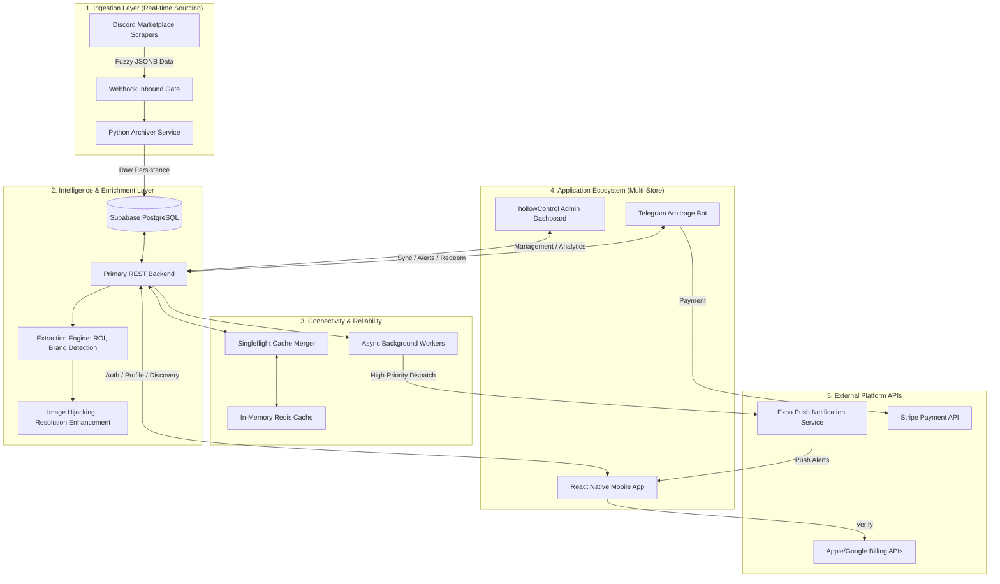
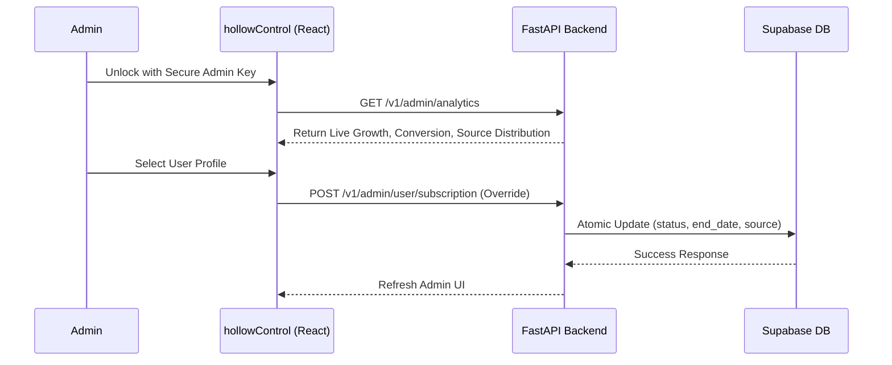
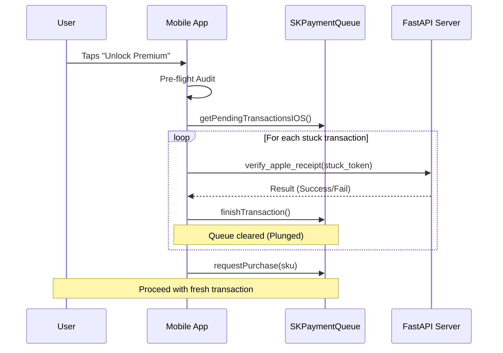
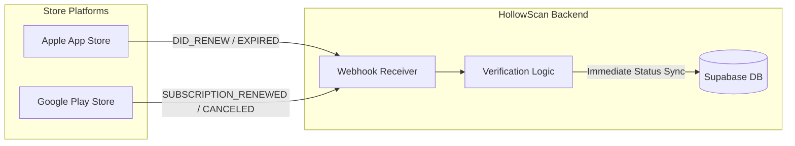
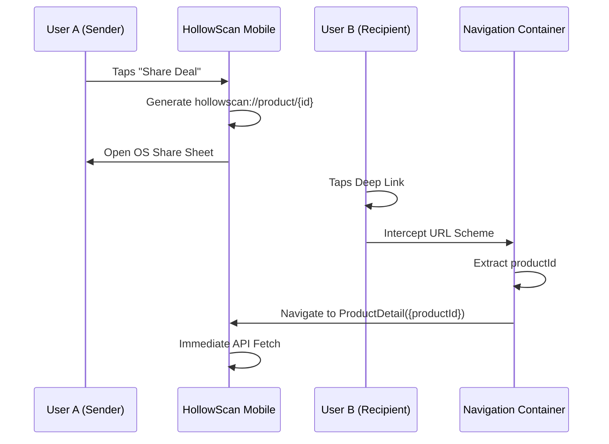
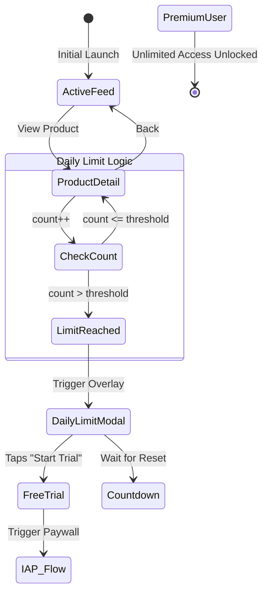

# HollowScan Mobile App - Live on [Google (Android) PlayStore](https://hollowscan.com/android) and [Apple (iOS) App Store](https://hollowscan.com/ios)

**HollowScan** is a powerful mobile arbitrage ecosystem designed to bridge the gap between real-time store monitoring and mobile discovery. It helps users discover underpriced products across multiple regions (US, UK, Canada) for resale profit. 

Built with **React Native**, **FastAPI**, and **Supabase**, HollowScan provides an industrial-grade scanning infrastructure integrated with Telegram bots and a hardened cross-platform subscription system.

---

## 🏛️ Grand Unified System Architecture

HollowScan is an industrial-grade arbitrage pipeline designed for high-concurrency ingestion and low-latency discovery. It handles thousands of marketplace updates daily with automated enrichment and self-healing resilience.

### 🔗 Repository Ecosystem
[HollowScan (Official Website) Github](https://github.com/joshuatochinwachi/HollowScan-Official-Website) || [Backend (FastAPI) Github](https://github.com/joshuatochinwachi/HollowScan-Fast-API-Backend) || [Telegram Bot & Scraper Github](https://github.com/joshuatochinwachi/dc_scrape)

### ⚙️ Backend (Infrastructure)
- **Engine**: FastAPI (Async Performance Optimized)
- **Database**: Supabase (PostgreSQL with Row Level Security)
- **Verification**: `google-api-python-client` & `httpx` for Apple S2S.
- **Real-time**: Telegram Bot API + Discord Scraper Integration.
- **DevOps**: EAS Build pipelines + Environment Isolation.



---

## 📚 Knowledge Hub: The Authoritative Documentation Library

HollowScan is a massive ecosystem. Use these authoritative guides for deep technical dives into specific sectors:

### 🏛️ System Design & Architecture
- **[Grand Architecture Diagram](./ARCHITECTURE_DIAGRAM.md)**: Deep dive into the global system flow.
- **[Subscription Architecture](./SUBSCRIPTION_ARCHITECTURE.md)**: Technical breakdown of the payment logic.
- **[Subscription Account Logic](./SUBSCRIPTION_ACCOUNT_LOGIC.md)**: The "Brain" behind cross-platform premium portability.
- **[Backend Schema Integration](./BACKEND_SCHEMA_INTEGRATION.md)**: Mapping mobile attributes to Supabase JSONB fields.

### 🚀 Production & Deployment
- **[iOS Production Build Guide](./IOS_BUILD_GUIDE_PRODUCTION.md)**: Essential steps for Apple App Store submission.
- **[Google Play Billing Integration](./google-play-billing-integration-guide.md)**: Audit of the Android Nitro v14 implementation.
- **[Deployment Workflow](./DEPLOYMENT_GUIDE.md)**: Production release and EAS submission checklist.
- **[EAS Build Guide](./EAS_BUILD_GUIDE.md)**: Configuration for internal and store-ready builds.
- **[Live Updates Strategy](./LIVE_UPDATES_GUIDE.md)**: How the app handles OTA updates.

### 💳 IAP & Subscription Mastery
- **[High-Conversion IAP Design](./high-conversion-IAP.md)**: UI/UX research on maximizing premiums.
- **[Subscription Flow Logic](./SUBSCRIPTION_FLOW_GUIDE.md)**: Step-by-step logic for the cross-platform purchase loop.
- **[Payment Audit Report](./PAYMENT_AUDIT_REPORT.md)**: Security verification for Apple/Google transactions.
- **[Google Pay Diagnostics](./google_pay_payment_diagnostic.md)**: Troubleshooting state machine for Android billing.

### 🤖 Telegram & Bot Integration
- **[Quick Start Telegram](./QUICK_START_TELEGRAM.md)**: How to set up and link the bot in seconds.
- **[Telegram Integration Guide](./TELEGRAM_INTEGRATION_GUIDE.md)**: Full protocol for linking mobile IDs to chat sessions.
- **[Premium Sync Logic](./TELEGRAM_PREMIUM_SYNC.md)**: Deep dive into the mobile-to-bot sync mechanism.

### 🎨 Feature Highlights
- **[Home Screen Layout](./home_screen_layout_diagram.md)**: Professional UI integration of the ticker and feed.
- **[Profile Screen Features](./PROFILE_SCREEN_FEATURES.md)**: Account management and localized settings.
- **[App Status Overview](./APP_STATUS.md)**: Real-time feature checklist and build stability report.

---

## 🛡️ Engineering Excellence & Security

### Architectural Principles
- **Service-Oriented Logic**: Business logic is decoupled from UI components into dedicated `services/` (e.g., `SubscriptionService`, `LiveProductService`), ensuring high testability and separation of concerns.
- **Centralized State Management**: Optimized use of the **React Context API** to manage high-frequency authentication and user profiles globally without the overhead of external state libraries.
- **Custom Hook Pattern**: Extensive use of specialized hooks to encapsulate complex device interactions (Haptics, StoreKit, Android Billing), keeping components declarative and clean.

### Security Standards
- **Authenticated Proxy Architecture**: All backend requests are proxied via Supabase-style verified headers, preventing direct database exposure and ensuring zero-trust communication.
- **Secure Persistence**: Sensitive session data is handled with lifecycle-aware state management, with local tokens stored securely via `AsyncStorage` and encrypted where required.
- **Environment Isolation**: Production secrets (API keys, project IDs) are strictly managed via `eas.json` for mobile and server-side `.env` files for backend services.

---

## 🛠️ Administrative Control Hub (hollowControl)

HollowScan is managed via a professional-grade **React + Vite** administration dashboard, providing real-time platform insight and atomic management capabilities.

### 1. The Management Pipeline
Ensures platform integrity through secure administrative overrides and live metrics tracking.



### 2. Key Administrative Capabilities
- **Real-time Conversion Analytics**: Granular tracking of conversion rates (Free → Premium) and user growth velocity (24h/Total) across all regions.
- **Unified User Auditing**: Searchable database of all users, linked Telegram identities, and joining metadata for customer support.
- **Subscription Overrides**: The ability to manually grant premium status, adjust expiry dates, or restricted access with full audit logs of the change source (Apple/Google/Manual).

---

## 🔍 The Search & Discovery Engine

The core value proposition of HollowScan is its ability to find "needles in haystacks" across thousands of fuzzy data points with millisecond latency.

### 1. Multi-Field JSONB Search
The backend implements a high-performance `ilike` query strategy that searches simultaneously across several nested JSONB fields:
- `raw_data -> embeds -> 0 ->> title` (Store Titles)
- `raw_data -> embed ->> description` (Product Attributes)
- `raw_data -> author ->> name` (Bot-scraped brand detection)
- `category_name` & `region` tags for zero-delay filtering.

### 2. Cache-Stampede Protection (Singleflight)
To prevent server overload during "Hero" restock events (where thousands of users hit the API simultaneously), HollowScan uses a **Singleflight Merger Pattern**: 
- **The Problem**: Multiple identical requests hitting the DB at the same time.
- **The Solution**: The server detects duplicate concurrent requests, initiates only **one** DB fetch, and fulfills all pending requests with the same result once it arrives.

### 3. High-Value Throttling
- **Premium Discovery**: 100+ cached high-velocity items with multi-regional fallback logic.
- **Free Discovery**: Capped at a curated batch of 4 high-value items with `is_locked: true` metadata, enticing trial conversions through scarcity.
- **Hero Priority**: High-demand deals are injected with distinctive styling and priority notification hooks.

---

## ⚡ Data Pipeline & Intelligent Enrichment

HollowScan enriches raw marketplace data into actionable trader intelligence through a multi-stage transformation pipeline.

### 1. The ROI & Margin Engine
Every product extracted from raw Discord JSONB is processed for profitability:
- **Formula**: `(Resell Price - Store Price) / Store Price * 100`
- **Normalization**: Handles currency detection (USD/GBP/CAD) to provide a unified ROI percentage across all feed cards.

### 2. High-Fidelity Image Hijacking
The system bypasses retailer resolution limits to maintain a professional UI:
- **URL Transformation**: Strips Amazon's `.SL160.` and eBay's `.s-l300.` tags, forcing source servers to deliver maximum 1200px+ resolution assets.
- **JSON-LD Crawling**: Falls back to original page metadata if image proxies are restricted.
- **Deduplication Signatures**: Every deal is hashed via a `content_signature` to ensure the feed remains clean and free of duplicate restock alerts.

---

## 📂 Project Structure & Module Mapping

HollowScan is a massive ecosystem. This map represents the complete, non-shallow directory structure.

### 📱 Mobile Application (React Native)
```text
hollowscan_app/
├── components/                      # UI Molecules & Atoms
│   ├── AnnouncementBanner.js        # High-priority scrolling ticker
│   ├── DailyLimitModal.js           # Gating logic & conversion triggers
│   └── InfoModal.js                 # Unified semantic alert system
├── context/                         # Persistent State
│   └── UserContext.js               # Global Brain: Auth, Premium, & Profile sync
├── screens/                         # Feature Containers (All 14 Screens)
│   ├── HomeScreen.js                # Core Discovery Engine & Filter Layout
│   ├── ProductDetailScreen.js       # Transactional View & ROI Visuals
│   ├── PremiumPaywallScreen.js      # Revenue Hub & Trial Triggers
│   ├── ProfileScreen.js             # Account Management & Region Settings
│   ├── SavedScreen.js               # Cloud-synced Bookmarks
│   ├── AlertsScreen.js              # Historical Push Notification Log
│   ├── SettingsScreen.js            # Global Preferences & Theme Toggles
│   ├── LoginScreen.js / SignupScreen.js # Auth Lifecycle
│   ├── ForgotPasswordScreen.js      # Password Recovery Loop
│   ├── VerificationScreen.js        # OTP & Email Verification
│   ├── SplashScreen.js              # Initial App Boot & Bootstrapping
│   ├── TelegramLinkScreen.js        # Account Sync & Pairing Hub
│   └── ChangePasswordScreen.js      # Secure Credential Management
├── services/                        # Infrastructure Logic
│   ├── SubscriptionService.js       # IAP Logic: Plunger, Verification, Queue Management
│   ├── PushNotificationService.js   # Notification Hub & Token Lifecycle
│   ├── LiveProductService.js        # API Orchestrator & Cache Injection
│   └── NavigationService.js         # Decoupled Navigation Logic
├── utils/                           # Core Business Utilities
│   └── format.js                    # Unified Currency & Date Formatting
└── telegram_bot.py                  # THE BOT: 177KB Python engine for high-res alerts
```

### 🛰️ Backend Ecosystem (FastAPI)
```text
hollowscan_backend/
├── app.py                           # Application Gateway & Route Controller
├── apple_iap_utils.py               # Apple S2S Receipt Verification logic
├── google_play_utils.py             # Google Play Billing v14 handler
├── supabase_utils.py                # Database & Storage Abstraction
├── cache_utils.py                   # Singleflight & Redis management
└── admin_dashboard/                 # React-based hollowControl GUI
```

---

## 📱 Full Feature Matrix

| Screen | Core Responsibility | Technical Requirement |
| :--- | :--- | :--- |
| **discovery Feed** | Live Discovery | Singleflight-protected feed with batch refill (+50 batching). |
| **Saved Deals** | Cloud Bookmarks | Atomically synced bookmarks in Supabase `saved_deals`. |
| **Paywall Hub** | Revenue Gating | Resilient IAP with "Plunger" logic and trial detection. |
| **Auth lifecycle** | User Onboarding | JWT-based auth with secure reset capability via Postmark. |
| **Alerts History** | Notification Log | Persistent history of region-filtered push alerts. |
| **Telegram Sync** | Cross-Platform Pairing | OAuth-style chat ID mapping for premium synchronization. |

---

## 💳 Hardened IAP & Subscription Architecture

HollowScan implements a resilient, cross-platform subscription system using the **Nitro Architecture (`react-native-iap` v14)**.

### 1. The "iOS Plunger" Mechanism (Queue Remediation)
Stuck transactions are the #1 cause of IAP churn. HollowScan implements an aggressive "plunger" strategy:



### 2. Android Lifecycle Support
- **Trial States**: Explicit support for `paymentState: 2` (Free Trial) in backend verification, preventing 400 errors for new users.
- **Forced Acknowledgment**: Every verified Android purchase is explicitly acknowledged via the Developer API to prevent automatic Google refunds.

### 3. Server-to-Server (S2S) Webhooks
HollowScan doesn't just wait for the app to open to update status. We listen to Apple and Google directly.



### 4. Startup Recovery Flow
Handled in `UserContext.js`, the app automatically polls for unacknowledged purchases on launch, ensuring that a user who paid but crashed before verification still receives their Premium status.

---

## 🔔 High-Priority Push Notification Ecosystem

HollowScan uses a real-time notification pipeline to deliver deals before they saturate the market.

### 1. The Alert Pipeline
- **Trigger**: Scrapers detect a deal → Backend generates payload → Dispatches to **Expo Push Service**.
- **Self-Healing Dispatch**: A background worker in `app.py` continuously monitors the dispatch queue.
- **Deep Linking**: Notifications carry an atomic `product_id` payload, allowing the app to navigate directly to the specific deal when tapped.

### 2. Stale Token Remediation
To prevent notification lag, the backend removes failed tokens automatically. If Expo returns a `DeviceNotRegistered` error, the backend identifies the user and purges the stale token from the `push_tokens` JSONB array in Supabase.

---

## 🤖 Identity & Telegram Premium Sync

HollowScan uses a **Decoupled Identity Model**, ensuring a user's premium status follows their account across all platforms.

### 1. Cross-Platform Pairing
1. User starts the `@HollowScanBot` on Telegram.
2. Bot generates a unique **Chat ID Mapping**.
3. User enters the ID into the `TelegramLinkScreen.js` on mobile.
4. Backend atomically links the ID to the `user_id`, syncing status to the bot's private storage bucket.

### 2. Multi-Store Portability
- **The Loop**: Buy on **iOS** → Sync to **Telegram** → Log in on **Android**.
- All platforms reference a single `expiry` timestamp in Supabase, ensuring global status integrity.

---

## 🏗️ Infrastructure Resilience & DevOps

Built for high-traffic environments and "Zero Downtime" scalability.

### 1. Patience Database Startup (PDS)
To handle cold starts or database maintenance, the backend implements **90-second Patience Logic**. On launch, the `lifespan` manager pings Supabase iteratively, waiting for readiness before accepting any client connections.

### 2. High-Capacity Connection Pooling
Utilizes `httpx.AsyncClient` with tuned pooling parameters:
- **50 Keep-alive connections** for persistent database streams.
- **200 Max connections** to handle traffic bursts during "Hero" restock announcements.

### 3. Background Persistence Worker
An async worker runs 24/7 inside the backend to:
- Monitor the Discord scraping pipeline.
- Clean up expired cache entries.
- Re-verify critical S2S receipts that failed initial acknowledgment.

---

## 🔗 Deep Linking Architecture

HollowScan leverages native URI schemes to facilitate viral deal sharing and seamless navigation from external platforms.

### 1. The Share-to-Navigation Loop
When a user shares a deal, the app generates a `hollowscan://` protocol link that bypasses traditional browser friction.



---

## 🎨 UI/UX Philosophy

The interface is designed for **speed and clarity**, essential for fast-moving arbitrage markets.

- **Glassmorphism Design**: Use of `expo-blur` for semi-transparent modals and headers that provide a high-end, futuristic feel.
- **Dynamic Theming**: First-class support for **System Dark/Light modes** with high-contrast deal cards and custom typography.
- **Micro-Animations**: Extensive use of haptic feedback and smooth transitions in the feed to enhance the "discovery" sensation.
- **Diagnostic Transparency**: Professional-grade IAP status UI in `PremiumPaywallScreen.js`, providing clear feedback on subscription health.

---

## ⏳ Gating & Daily Limit Mechanism

To maximize conversion from free to premium, HollowScan implements a sophisticated gating mechanism controlled via the **React Context API**.

### 1. The Conversion State Machine
Users have a frictionless initial discovery experience that transitions into a high-value conversion path.



---

## 🤖 HollowScan Bot: High-Fidelity Image Engine

The Telegram Bot serves as a high-fidelity ingestion layer, ensuring users see crystalline product images even when source embeds are low quality.

### 1. The Resolution Enhancement Pipeline
The bot implements "URL Hijacking" logic to force retailers to deliver their maximum resolution assets.
- **Slash Removal**: Strips Amazon's `.SL160.` and eBay's `.s-l300.` tags, forcing 1200px+ resolution.
- **JSON-LD Scraping**: If images are restricted, the scraper crawls external metadata for the original `og:image` path.

### 2. Intelligent Link Analytics
Beyond images, the bot parses thousands of lines of raw deal data to categorize links with automated icons:
- `💰 Sold Listings`: Instant research on market value.
- `📈 Keepa Charts`: Integrated price history monitoring.
- `🛒 Direct Checkout`: High-priority action links.

---

## Map to Future Roadmap

- [ ] **AI-Powered Deal Scoring**: Predicting sell-out velocity based on historical trends.
- [ ] **Multi-Currency Arbitrage**: Real-time conversion tracking for international flips.
- [ ] **Developer API**: Authenticated access for third-party discovery tools.

---

**Built with ❤️ for arbitrage enthusiasts**
