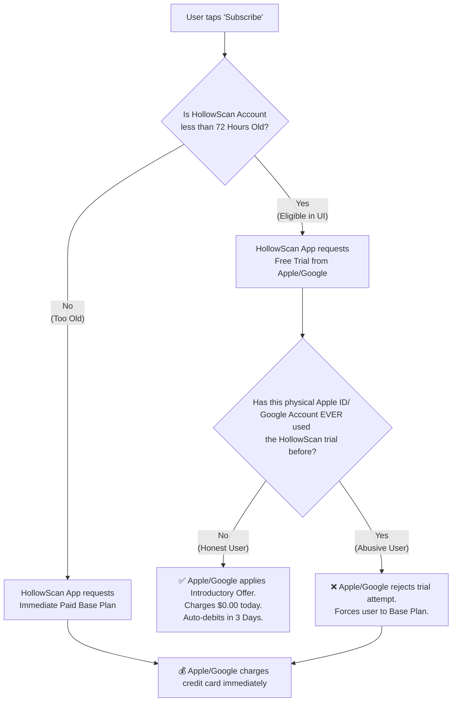

# HollowScan Subscription Account Logic

This document explains the strict separation between **HollowScan Accounts (Email)** and **Platform Accounts (Apple ID / Google Play `@gmail.com`)**, and how they interact to prevent billing abuse while maximizing conversions.

---

## 1. The Core Philosophy

There are two completely separate "identities" when a user is interacting with your app. **They do not need to match, and they are completely blind to each other.**

1. **The In-App Identity (HollowScan Email):**
   * Examples: `josh_trader@yahoo.com`
   * **What it controls:** Your database, the UI you show in the app, and the `isTrialEligible` UI variable.
   * **Rule:** An account is eligible for the 3-day UI trial badge *only* if this specific HollowScan account was created less than 72 hours ago.

2. **The Financial Identity (Apple ID / Google Account):**
   * Examples: `josh_personal@gmail.com` (Logged into the App Store / Play Store)
   * **What it controls:** The physical credit card, the absolute source of truth for free trial eligibility, and the physical transaction.
   * **Rule:** A human being can **ONLY EVER USE ONE FREE TRIAL** per physical Apple ID or Google Account. Period.

---

## 2. Decision Flowchart

Below is the logical flow of what happens the moment a user presses the **Subscribe** button in HollowScan.

---

## 3. Real-World Scenarios

### Scenario 1: The "Mismatched Emails" (Completely Seamless)
* **HollowScan Email:** `business_resell@company.com`
* **Apple ID / Google Play:** `my_childhood_email@gmail.com`
* **What happens:** 
    1. The user taps subscribe.
    2. Apple/Google charges `my_childhood_email@gmail.com`'s credit card and generates a highly secure, anonymous **Purchase Token** (e.g., `token_xyz123`).
    3. Apple/Google intentionally **hides** the `my_childhood_email@gmail.com` address from us for privacy reasons. We never see it!
    4. The app simply takes `token_xyz123` and sends it to our backend, declaring: *"Assign this token to HollowScan User `business_resell@company.com`"*.
    5. **Result:** Perfect success. It does not matter if the emails are different, because the app maps the physical purchase to whoever is currently logged into the HollowScan app.

### Scenario 2: The Honest New User
* **HollowScan Email:** Brand new (`honest@email.com`)
* **Apple ID / Google Play:** Never downloaded HollowScan before.
* **What happens:** 
    1. The app sees the account is new and shows the "3 DAYS FREE" badge.
    2. The user taps subscribe. Our code asks Apple/Google for a trial.
    3. Apple/Google checks the biological person's Apple ID, sees they are clean, and grants the trial.
    4. **Result:** The user is charged $0.00. 72 hours later, Apple/Google auto-debits their card for $4.99 automatically.

### Scenario 3: The Slow Decider (Old Account)
* **HollowScan Email:** 3 months old (`slow@email.com`)
* **Apple ID / Google Play:** Never subscribed to HollowScan.
* **What happens:** 
    1. The app sees the account is older than 72 hours.
    2. The app **hides** the "3 DAYS FREE" badge and instead says "Billed Monthly".
    3. The user taps subscribe. **Our code forces the app to request the Base Paid Plan.**
    4. **Result:** Even though the Apple ID is technically clean, our code strictly demands the user pay immediately. The Apple/Google payment sheet charges $4.99 immediately.

### Scenario 4: The Abuser (New HollowScan, Old Phone)
* **HollowScan Email:** Brand new fake email (`abuser_fake@email.com`)
* **Apple ID / Google Play:** Used a 3-day trial 2 weeks ago on a different email.
* **What happens:** 
    1. The app sees the account is < 72 hours old and shows the "3 DAYS FREE" badge.
    2. The user taps subscribe, hoping to get another 3 days free.
    3. Our code asks Apple/Google for a trial.
    4. **Apple/Google steps in like a bouncer.** They scan the physical Apple ID / Google Account, see the history, and instantly reject the trial silently.
    5. **Result:** The Apple/Google payment sheet pops up on their screen demanding $4.99 immediately. The abuser is physically blocked from getting another 3 free days.

### Scenario 5: The Multi-Account Payer
* **HollowScan Email:** User pays for Premium on `josh1@gmail.com`. They log out, and log back in with `josh2@gmail.com`.
* **Apple ID / Google Play:** Already has an active subscription.
* **What happens:** 
    1. If they try to buy Premium again on `josh2`, Apple and Google will throw an error saying *"You already have an active subscription for this app."*
    2. To get premium on `josh2`, the user simply taps the **"Restore Purchases"** button in your app. 
    3. **Result:** Our code grabs the active Apple/Google anonymous purchase token that is secretly stored on the phone, sends it to the backend, and transfers Premium to the `josh2` HollowScan account in your database.

---

## Summary
You are **100% immune** to email mismatches and people spamming new emails to get infinite free trials. 
Because Apple and Google tie the trial strictly to the unified ecosystem account (Apple ID / Play Store Account), and generate anonymous tokens the backend uses to grant access, none of this logic relies on matching emails. It is completely seamless.
