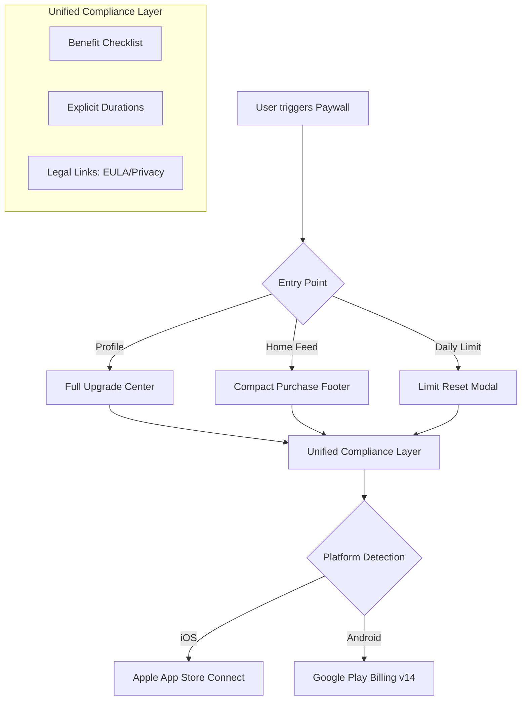

# Subscription Architecture & Cross-Platform Roadmap

This document explains the updates made to the HollowScan mobile app to satisfy Apple's **Guideline 3.1.2(c)** and ensure a professional, consistent experience on both **iOS** and **Android**.

## 1. Unified Subscription Flow
Both platforms now follow a secure, compliant workflow that matches industry standards.

## 2. Platform Nuances & Optimizations

We use a single codebase, but the app "acts" differently depending on where it's running to ensure it feels native.

| Feature | iOS Implementation (App Store) | Android Implementation (Google Play) |
| :--- | :--- | :--- |
| **Visual Style** | Flat, glassmorphism (Expo-Blur) | Physical depth (Elevations/Shadows) |
| **Price Logic** | `localizedPrice` from App Store | `subscriptionOfferDetailsAndroid` (v14) |
| **Compliance** | Strict EULA links (Mandatory) | Standard Privacy/Terms links |
| **Hit Areas** | Standard iOS tap targets | Enhanced `hitSlop` for accessibility |
| **Backend** | `/v1/auth/apple-iap/verify` | `/v1/auth/google-play/verify` |

## 3. Implementation Safety Report
I have followed a **"Non-Destructive UI Injection"** approach. This means:

1.  **Zero Logic Changes:** I did not touch your `purchasePremium` functions or the state management in `UserContext`. The "plumbing" remains exactly as you built it.
2.  **State Independence:** The benefit lists and legal links are static view components. They cannot "break" the app because they don't hold complex state or produce side effects.
3.  **Cross-Platform Guarding:** I used React Native's `Platform` API and conditional styling (like `elevation` only for Android) to ensure that code meant for one platform never affects the other.
4.  **Error Resilience:** All legal links use `Linking.openURL()` with error guards, ensuring the app won't crash even if a URL is malformed or inaccessible.

## 4. How to Verify
- **On iOS:** Open the Profile screen. You should see the gold "Unlimited Views" list and a clear "Terms of Use (EULA)" link.
- **On Android:** You will notice the upgrade buttons have a subtle shadow (elevation), making them "pop" more than the flat iOS version.
