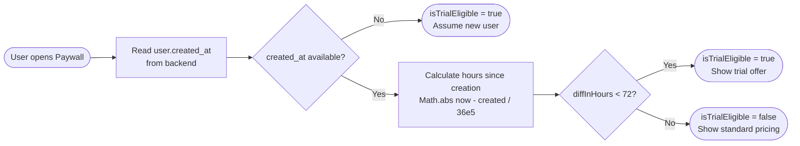

# HollowScan — Subscription & Payment Flow Guide

> **Last Updated:** April 2026  
> **Platforms:** iOS (App Store / StoreKit) & Android (Google Play Billing)  
> **Library:** `react-native-iap` v14+

---

## Table of Contents
1. [Architecture Overview](#architecture-overview)
2. [End-to-End Payment Flow](#end-to-end-payment-flow)
3. [Trial Eligibility Logic](#trial-eligibility-logic)
4. [User Scenarios](#user-scenarios)
5. [Platform Differences: iOS vs Android](#platform-differences-ios-vs-android)
6. [Error States & Edge Cases](#error-states--edge-cases)
7. [Key Files Reference](#key-files-reference)

---

## Architecture Overview

The subscription system has **three layers** that must all agree before a user is granted Premium access:

```
┌────────────────────────┐
│   React Native App     │  ← UI Layer (PremiumPaywallScreen, HomeScreen)
│   (react-native-iap)   │
└───────────┬────────────┘
            │ Purchase Token / Receipt
            ▼
┌────────────────────────┐
│   SubscriptionService  │  ← IAP Middleware (services/SubscriptionService.js)
│   (Listeners + Verify) │
└───────────┬────────────┘
            │ POST /v1/auth/google-play/verify  (Android)
            │ POST /v1/auth/apple-iap/verify    (iOS)
            ▼
┌────────────────────────┐
│   Railway Backend      │  ← Source of Truth (Python/FastAPI)
│   + Supabase DB        │
└────────────────────────┘
```

**CRITICAL RULE:** Premium status is ONLY set when the Railway backend confirms `success: true`. No local shortcuts or assumptions.

---

## End-to-End Payment Flow

```mermaid
flowchart TD
    A([User opens App]) --> B{Has saved session?}
    B -- Yes --> C[Load user from AsyncStorage]
    B -- No --> D[Show Login / Signup Screen]

    C --> E[refreshUserStatus called]
    E --> F[GET /v1/user/status]
    F --> G{Backend says isPremium?}
    G -- Yes --> H([Premium UI: No Blurs, Unlimited Feed])
    G -- No --> I([Free UI: Blurred Data, Go Premium Button])

    I --> J{User taps a blurred product\nor Go Premium}
    J --> K[Navigate to PremiumPaywallScreen]

    K --> L{isTrialEligible?\nAccount < 72hrs old?}
    L -- Yes --> M[Show 3-Day Free Trial CTA\nStart Free Trial button\n3 DAYS FREE badge]
    L -- No --> N[Show Standard CTA\nGet Started button\nNo trial mention]

    M --> O[User taps Start Free Trial]
    N --> P[User taps Get Started or Subscribe Yearly]

    O --> Q[purchasePremium called]
    P --> Q

    Q --> R[SubscriptionService.requestSubscription]

    R --> S{Platform?}
    S -- iOS --> T[Apple StoreKit Payment Sheet]
    S -- Android --> U[Google Play Billing Sheet]

    T --> V{User Action on Sheet}
    U --> V

    V -- User Cancels --> W([No alert shown. User stays on Paywall.])
    V -- User Confirms --> X[purchaseUpdatedListener fires]

    X --> Y[Extract token\npurchaseToken Android\ntransactionReceipt iOS]
    Y --> Z[verifyWithBackend called]

    Z --> AA{Platform?}
    AA -- iOS --> AB[POST /v1/auth/apple-iap/verify\nwith receipt_data]
    AA -- Android --> AC[POST /v1/auth/google-play/verify\nwith purchase_token]

    AB --> AD{Backend response}
    AC --> AD

    AD -- success: false --> AE([Show Verification Failed warning\nPremium NOT granted])
    AD -- success: true --> AF[finishTransaction called\nTransaction acknowledged]

    AF --> AG[onSuccess callback fires in UserContext]
    AG --> AH[refreshUserStatus with injected data]
    AH --> AI[User state updated: isPremium = true]
    AI --> AJ([Alert: You're Premium! 🚀\nShown ONLY now])
    AJ --> AK([All blurs removed\nUnlimited feed active])
```



---

## Trial Eligibility Logic



**The key rule:** `created_at` comes from the backend user object and is stored in `AsyncStorage`. The field is checked as `user.created_at || user.created || user.createdAt` to handle any naming convention from the API.

---

## User Scenarios

### Scenario 1 — Brand New User (iOS, < 72 hours old)

**Profile:** Emma just downloaded HollowScan from the App Store. She creates an account at 10:00am Monday.

**Journey:**
1. Emma signs up → `needsOnboarding = true` is set → she's shown the Paywall immediately.
2. `isTrialEligible` calculates `0 hours < 72` → **true**.
3. She sees: **"3 DAYS FREE"** badge, **"Start Free Trial"** button, billing subtext reads *"Then regular price. Cancel anytime."*
4. She taps **"Start Free Trial"**.
5. Apple's native payment sheet appears with the trial offer.
6. She confirms with Face ID.
7. `purchaseUpdatedListener` fires with her `transactionReceipt`.
8. The receipt is sent to Railway's Apple IAP verify endpoint.
9. Backend confirms → `finishTransaction` acknowledged → state set to `isPremium: true`.
10. **"You're Premium! 🚀"** alert appears.
11. All blurs are removed. Emma sees full Market Price, ROI, and Store Name data.

**What happens if she cancels at step 6?**
→ `purchaseErrorListener` fires with code `E_USER_CANCELLED`. No alert is shown. She stays on the Paywall screen.

---

### Scenario 2 — Existing Free User (Android, > 3 days old)

**Profile:** Marcus signed up 2 weeks ago, used the free features, and now wants to upgrade.

**Journey:**
1. Marcus opens the app → `isTrialEligible` = **false** (account is 336 hours old).
2. He sees the Paywall with **no "3 DAYS FREE" badge**. Button reads **"Get Started"**.
3. He selects the **Yearly Pro** plan.
4. Google Play Billing sheet appears showing the yearly price directly.
5. He confirms payment with his Google account.
6. `purchaseUpdatedListener` fires with `purchaseToken`.
7. `SubscriptionService` sends token to Railway's Google Play verify endpoint.
8. Backend confirms `success: true` → state updated → **"You're Premium! 🚀"** alert shows.
9. Feed unlocks instantly. No more blurs.

---

### Scenario 3 — Returning Premium User (Both Platforms, App Reinstall)

**Profile:** Sarah had Premium, deleted the app, and reinstalled it.

**Journey:**
1. Sarah reinstalls the app and logs in.
2. `loadUserData()` restores from AsyncStorage (if present) or fetches fresh from backend.
3. `refreshUserStatus()` is called → backend returns `is_premium: true` with a valid `subscription_end` date.
4. `isPremium` computed property evaluates to `true`.
5. Sarah lands directly on a **fully unlocked HomeScreen** with no blurs, no Paywall shown.

**What if she uses a new phone with no cached data?**
→ Same result — `refreshUserStatus()` hits the backend on startup and restores her status from the database. The IAP startup recovery (`SubscriptionService.restorePurchases()`) runs as an additional safety net.

---

### Scenario 4 — User Tries to Restore Purchases (iOS)

**Profile:** James switched from an Android to an iPhone and wants to restore his subscription purchased through Google Play.

**Outcome:** Cross-platform restore is **not possible** by Apple/Google policy. Subscriptions are tied to the platform's billing account. James will need to purchase a new iOS subscription. The app handles this correctly — the **"Restore Purchases"** button will return `false` (nothing to restore) and show: *"We couldn't find an active subscription associated with this account."* — it will not crash.

**What if he had previously purchased on iOS and reinstalled?**
1. James taps **"Restore Purchases"**.
2. `SubscriptionService.restorePurchases()` calls `getAvailablePurchases()`.
3. Apple returns his existing active subscription.
4. `verifyWithBackend()` is called for each purchase found.
5. Backend confirms → `finishTransaction` → `isPremium: true`.
6. Alert shows: **"Your Premium access has been restored! 🚀"**

---

### Scenario 5 — Trial User Who Doesn't Cancel (Conversion)

**Profile:** Liam started the 3-day free trial on Wednesday. He forgot about it, and Saturday arrives.

**What happens:**
1. Apple/Google automatically charges him the monthly price at the end of the trial period.
2. The subscription is renewed in the App Store/Play Store billing system.
3. The next time Liam opens the app and `refreshUserStatus()` runs, the backend syncs the updated subscription expiry date.
4. His `isPremium` status remains `true`. He remains a paying customer with no action needed from him.

---

### Scenario 6 — Trial User Who Cancels Before Trial Ends

**Profile:** Olivia started the 3-day trial but cancels on Day 2 through her phone settings.

**Journey:**
1. Olivia goes to Settings → Subscriptions on her iPhone and cancels.
2. **The app does not know this in real time.** She still has Premium access until the trial period actually expires.
3. When the trial expires (Day 3), Apple stops renewing. The `subscription_end` date passes.
4. On her next app open, `refreshUserStatus()` syncs → `is_premium: false` from the backend.
5. `isPremium` computed property returns `false`. Blurs reappear. She's back to the free tier.
6. If she opens the Paywall again, `isTrialEligible` is **false** (account is now > 72 hours old), so the trial offer is **not shown again**.

---

### Scenario 7 — Offline User

**Profile:** David is on a plane with no internet. He already has Premium.

**Journey:**
1. David opens the app. `AsyncStorage` has his cached `user_data` with `isPremium: true` and a valid `subscription_end` date in the future.
2. `refreshUserStatus()` fails silently (no network).
3. The `isPremium` computed property uses the **cached** `user.isPremium` and `user.subscription_end` from `AsyncStorage`.
4. Because the expiry date is in the future, `isPremium` returns `true`.
5. David gets full access. No blurs.

**What if he's offline and never paid?**
→ `AsyncStorage` has `isPremium: false` (no valid expiry). `isPremium` returns `false`. Blurs appear normally. No false positives.

---

### Scenario 8 — Premium via Telegram

**Profile:** Noah paid via the Telegram bot (separate payment flow), not through the app stores.

**Journey:**
1. Noah links his Telegram account in ProfileScreen.
2. `checkTelegramStatus()` is called → backend returns `is_premium: true`, `premium_until: "2026-05-01"`.
3. State: `isPremiumTelegram: true`, `telegramLinked: true`, `premiumUntil: "2026-05-01"`.
4. `isPremium` computed property has a separate check for Telegram:
   ```js
   if (isPremiumTelegram && premiumUntil && telegramLinked) {
       const expiry = new Date(premiumUntil);
       if (expiry > now) return true;
   }
   ```
5. Noah sees a fully unlocked feed. He is **never shown** the Paywall.

**Security note:** If Noah unlinks his Telegram account, `telegramLinked` becomes `false`, and the Telegram premium check is immediately invalidated — even if `isPremiumTelegram` is still `true` in state. This prevents users from linking, paying, then unlinking to get free access.

---

## Platform Differences: iOS vs Android

| Feature | iOS (StoreKit) | Android (Google Play Billing) |
|---|---|---|
| **Purchase Token Field** | `transactionReceipt` (Base64 string) | `purchaseToken` (opaque string) |
| **Verification Endpoint** | `POST /v1/auth/apple-iap/verify` | `POST /v1/auth/google-play/verify` |
| **Receipt Format** | Legacy Base64 fetched via `getReceiptIOS()` | Direct token from Google Play |
| **JWS Handling** | Detected (`eyJ...`) and exchanged for legacy receipt | Not applicable |
| **Offer Token Required** | No | Yes — must extract `subscriptionOfferDetailsAndroid[0].offerToken` |
| **Trial Badge Shown** | Yes, if `isTrialEligible` | Yes, if `isTrialEligible` |
| **EULA Link** | Yes — Apple requires it for auto-renewable subs | No — Android does not require this |
| **Restore Purchases** | Via `getAvailablePurchases()` (re-verification) | Via `getAvailablePurchases()` (re-verification) |
| **Pending Transactions on Launch** | Cleaned up — `finishTransaction` called for any stuck purchases | Handled by Google Play automatically |

---

## Error States & Edge Cases

| Scenario | What Happens | User Sees |
|---|---|---|
| User cancels Apple/Google payment sheet | `E_USER_CANCELLED` caught, suppressed silently | Nothing. No alert. Stays on Paywall. |
| Backend verification fails (`success: false`) | `onError` callback fires. No `finishTransaction`. | "Verification Failed" console warning. No premium granted. |
| No internet when purchasing | `verifyWithBackend` throws a network error | "Could not complete" error alert via `onError` |
| Duplicate purchase attempt | `E_ALREADY_OWNED` from Google Play | Error alert shown with store's message |
| No products returned from store | `getSubscriptions` returns `[]`, fallback prices shown | User sees `£4.99 / mo` and `£55.50 / yr` (hardcoded fallbacks) |
| `purchase.purchaseToken` AND `transactionReceipt` both null | Fallback path in `setupPurchaseListeners` still calls `verifyWithBackend` | Backend verification attempted regardless |
| `user.created_at` missing from DB | `isTrialEligible` defaults to `true` | User sees trial offer (safe default — better UX for genuine new users) |
| Startup recovery finds unacknowledged transaction | `restorePurchases()` called on init, re-verifies with backend | Premium silently restored with no user input needed |

---

## Key Files Reference

| File | Responsibility |
|---|---|
| `screens/PremiumPaywallScreen.js` | Paywall UI, trial eligibility display, purchase/restore triggers |
| `services/SubscriptionService.js` | IAP connection, purchase listener, backend verification, restore |
| `context/UserContext.js` | Global premium state, `isPremium` computed, `isTrialEligible`, success alert |
| `screens/HomeScreen.js` | Product feed, blur overlays, "Go Premium" CTA |
| `screens/ProfileScreen.js` | In-profile upgrade CTAs, Telegram link, legal links |
| `Constants.js` | `API_BASE_URL`, brand colours |

---

> **Important for Testers:** Always use **Sandbox accounts** (Apple: App Store Connect → Sandbox Testers, Google: Play Console → License Testers) when testing purchase flows. Real purchases cannot be refunded easily and real receipts behave differently from sandbox.
