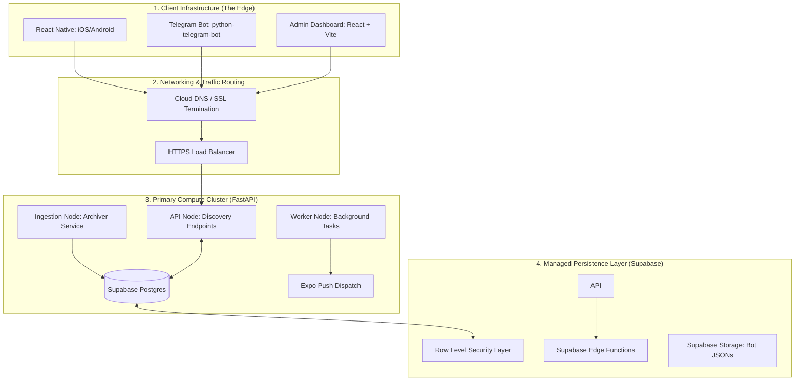
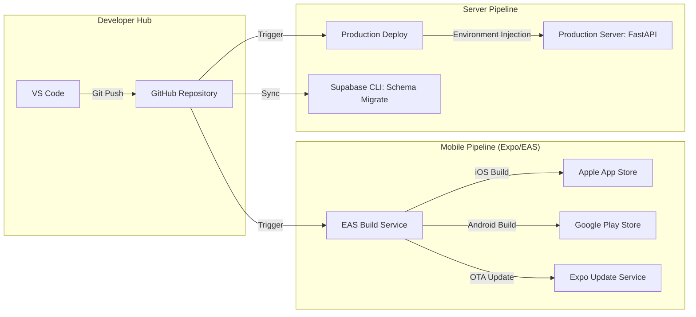

# HollowScan System Architecture Specification
## The Infrastructure Blueprint & Topology Document

---

## 1. Architectural Vision
The HollowScan architecture is designed as a **Micro-Orchestrated Discovery Engine**. It utilizes a hybrid model combining high-performance Python nodes for ingestion with a React-Native frontend and a robust, managed serverless persistence layer.

---

## 2. Infrastructure Topology

The system is distributed across three primary infrastructure domains: **The Edge (Clients)**, **The Core (API & Ingestion)**, and **The Persistence Layer (Managed DB)**.

---

## 3. Supabase & Edge Integration
HollowScan leverages Supabase not just as a database, but as a **BaaS (Backend as a Service)** layer.

### 3.1 Edge Functions vs. FastAPI
The architecture follows a "Responsibility Segregation" model:
- **FastAPI (Compute Core)**: Handles complex business logic, IAP verification state machines, and high-concurrency feed delivery.
- **Supabase Edge Functions**: Utilized for lightweight, low-latency hooks such as:
    - **Authentication Lifecycle**: Triggering database profile creation on Auth Sign-up.
    - **Webhooks Handling**: Initial capture and validation of lightweight external signals before persistence.

### 3.2 Row Level Security (RLS)
Security is enforced at the database layer. All client-side interactions via the API utilize **RLS Policies** to ensure:
- Users can only read their own profile and private `saved_deals`.
- Premium content (`alerts`) is filtered based on the `subscription_status` claim.

---

## 4. DevOps & Deployment Pipeline

HollowScan utilizes a modern CI/CD pipeline ensuring safe, reproducible releases for both the server and mobile clients.

### 4.1 Deployment Strategies
- **Mobile OTA**: Critical UI fixes are deployed via **Expo Updates**, bypassing the multi-day App Store review process for immediate user impact.
- **Atomic Schema Migration**: Database changes are managed via Supabase migrations, ensuring the API and DB schema remain in perfect lockstep during deployment.

---

## 5. Security & Traffic Flow
- **SSL/TLS**: All traffic is encrypted in transit using industry-standard TLS 1.3.
- **Admin Key Proxying**: The Admin Dashboard (`hollowControl`) communicates via a dedicated `X-Admin-Key` header, which is proxied and validated before any administrative action (overrides, bans) is executed.
- **CORS Protection**: The API Gateway enforces strict Cross-Origin Resource Sharing policies to prevent unauthorized web-based access.

---

## 6. Component Interaction Matrix

| Interaction | Protocol | Payload | Responsibility |
| :--- | :--- | :--- | :--- |
| **Mobile → API** | HTTPS / REST | JSON | Discovery feed, Auth, Profile management. |
| **Scraper → DB** | HTTP / SQL | JSONB | Ingestion, Deduplication, Archiving. |
| **API → Expo** | HTTP / POST | JSON | Real-time push notification dispatch. |
| **Stripe → Bot** | Webhook | JSON | Subscription renewal handling for Telegram. |
| **Bot → DB** | SQL / Storage | JSON | State persistence for chat sessions. |

---
