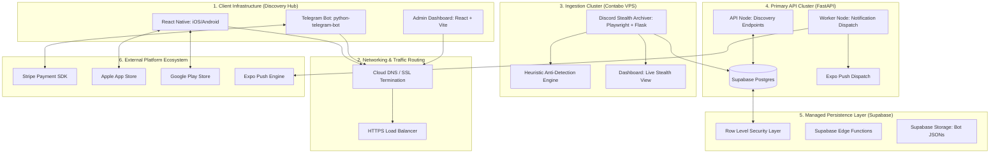
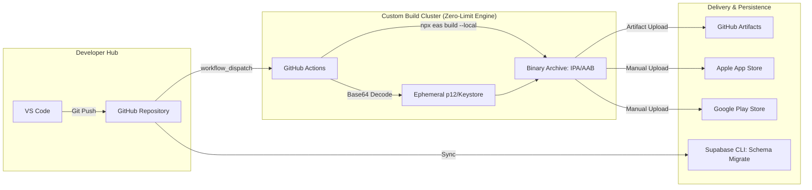

# HollowScan System Architecture Specification
## The Infrastructure Blueprint & Topology Document

---

## 1. Architectural Vision
The HollowScan architecture is designed as a **Micro-Orchestrated Discovery Engine**. It utilizes a hybrid model combining high-performance Python nodes for ingestion with a React-Native frontend and a robust, managed serverless persistence layer.

---

## 2. Infrastructure Topology

The system is distributed across three primary infrastructure domains: **The Edge (Clients)**, **The Core (API & Ingestion)**, and **The Persistence Layer (Managed DB)**.

---

## 3. Supabase & Edge Integration
HollowScan leverages Supabase not just as a database, but as a **BaaS (Backend as a Service)** layer.

### 3.1 Edge Functions vs. FastAPI
The architecture follows a "Responsibility Segregation" model:
- **FastAPI (Compute Core)**: Handles complex business logic, IAP verification state machines, and high-concurrency feed delivery.
- **Supabase Edge Functions**: Utilized for lightweight, low-latency hooks such as:
    - **Authentication Lifecycle**: Triggering database profile creation on Auth Sign-up.
    - **Webhooks Handling**: Initial capture and validation of lightweight external signals before persistence.

### 3.2 Row Level Security (RLS)
Security is enforced at the database layer. All client-side interactions via the API utilize **RLS Policies** to ensure:
- Users can only read their own profile and private `saved_deals`.
- Premium content (`alerts`) is filtered based on the `subscription_status` claim.
- **IAP Resilience Layer**: A dedicated mapping logic that bridges Apple's Server-to-Server (S2S) V2 notifications with the internal User ID using `appAccountToken`.

---

## 4. Resilient Subscription Sync (iOS/Android)

The subscription engine is designed with a **Defense-in-Depth** strategy to handle the inherent race conditions between the Mobile Client and the App Store Webhooks.

### 4.1 Token Mapping & De-conflicting
The architecture uses a two-stage identification process for iOS transactions:
- **Primary**: Internal `user_id` is passed as an `appAccountToken` (StoreKit 2) during the purchase handshake.
- **Secondary (Fallback)**: If the app verification call arrives before the webhook, the backend uses the `original_transaction_id` to link the transaction to the user permanently.

### 4.2 Webhook Handling
The FastAPI backend acts as a high-availability listener for Apple/Google webhooks:
- **Async Processing**: Subscriptions are updated in background tasks to prevent webhook timeouts.
- **Cross-Platform Reconciliation**: Ensures that if a user upgrades on iOS, their Telegram bot access is automatically granted via a shared `is_premium` flag in the Supabase schema.

---

## 5. DevOps & Deployment Pipeline

HollowScan utilizes a modern CI/CD pipeline ensuring safe, reproducible releases for both the server and mobile clients.

### 4.1 Deployment Strategies
- **Mobile OTA**: Critical UI fixes are deployed via **Expo Updates**, bypassing the multi-day App Store review process for immediate user impact.
- **Atomic Schema Migration**: Database changes are managed via Supabase migrations, ensuring the API and DB schema remain in perfect lockstep during deployment.

---

## 5. Security & Traffic Flow
- **SSL/TLS**: All traffic is encrypted in transit using industry-standard TLS 1.3.
- **Admin Key Proxying**: The Admin Dashboard (`hollowControl`) communicates via a dedicated `X-Admin-Key` header, which is proxied and validated before any administrative action (overrides, bans) is executed.
- **CORS Protection**: The API Gateway enforces strict Cross-Origin Resource Sharing policies to prevent unauthorized web-based access.
- **Credential Isolation (CI/CD)**: iOS Certificates (`.p12`) and Android Keystores are stored as **Base64-encoded GitHub Secrets**. They are ephemerally decoded at runtime within the isolated runner environment and purged immediately after the binary signing process (`npx eas build --local`), ensuring zero exposure of production keys in the codebase.

---

## 6. Component Interaction Matrix

| Interaction | Protocol | Payload | Responsibility |
| :--- | :--- | :--- | :--- |
| **Mobile → API** | HTTPS / REST | JSON | Discovery feed, Auth, Alert Preferences. |
| **Bot → DB** | SQL / Storage | JSON | Real-time discovery, State persistence. |
| **Bot → Stripe** | HTTPS / API | JSON | Direct Bot-side premium checkout. |
| **Scraper → DB** | HTTP / SQL | JSONB | Real-time Discord ingestion, Deduplication. |
| **Scraper → Admin** | SocketIO | Image/Logs | Live Stealth View for human monitoring. |
| **API → Expo** | HTTP / POST | JSON | Real-time push notification dispatch. |
| **Stripe → Bot** | Webhook | JSON | Subscription renewal handling. |

---
