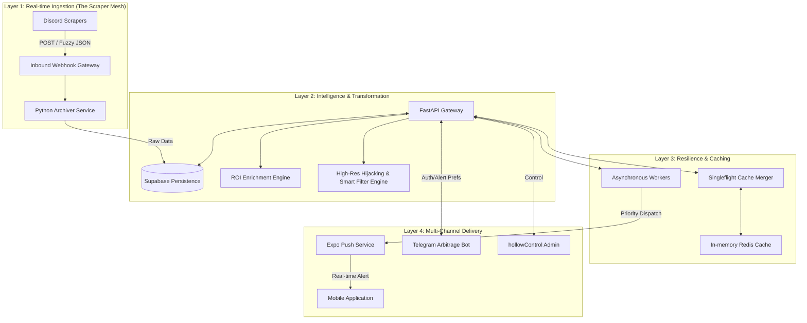

HollowScan is a distributed discovery ecosystem optimized for high-velocity marketplace arbitrage. The system bridges the gap between raw, unstructured marketplace signals (Discord, Webhooks) and actionable, high-fidelity consumer data. 

> [!NOTE]
> This document focus on the **Logic & Theory**. For the **Structural Blueprint & Infrastructure Topology**, see the [SYSTEM_ARCHITECTURE.md](./SYSTEM_ARCHITECTURE.md).

**Key Objectives:**
- **Zero Latency**: Sub-second deal ingestion to push notification delivery.
- **Cross-Platform Integrity**: Unified subscription status across iOS, Android, and Telegram.
- **Resilient Scalability**: Handling 10,000+ marketplace updates daily without database degradation.
- **Visual Fidelity**: Providing high-resolution imagery via source-transform "hijacking."

---

## 2. Distributed Layered Architecture

The HollowScan ecosystem is partitioned into four primary layers to ensure high availability and isolation of concerns.

---

## 3. Tier 1: Ingestion Pipeline & Scale
HollowScan is designed to ingest **10,000+ marketplace items daily**.

### 3.1 Multithreaded Archiver Logic
The **Python Archiver Service** operates as a non-blocking ingestion node. 
- **Batch Processing**: Instead of single-row inserts, the archiver buffers incoming webhooks and performs **SQL Batch Upserts** to minimize DB transaction overhead.
- **Deduplication Strategy**: Every deal is hashed via a `content_signature` (SHA-256 of Title + Description + URL). The database utilizes `ON CONFLICT DO NOTHING` to prevent feed pollution from duplicate restock notices.

### 3.2 Security Hardening: Discord Stealth Interaction
To bypass the most advanced Discord bot detection:
- **Stealth Browsing**: Instead of relying on static API tokens (easily monitored/flagged), the scraper uses **Playwright-driven Stealth Browsers** to navigate the interface.
- **Human Heuristics**: 
    - **Gaussian Delay**: All actions are randomized using Gaussian distribution to simulate human reaction times.
    - **Sidebar Interaction**: The scraper mimics a human by interacting with server icons and channel names in the sidebar rather than direct URL navigation.
    - **AI AFK Logic**: Simulated "Idle Breaks" and AFK states (3-10 minutes) prevent the account from exhibiting 24/7 robotic activity patterns.
- **Resolution Hijacking**: Bypassing retailer resolution limits (Amazon/eBay) by stripping size-limiting URL parameters (`.SL160.`, `.s-l300.`), delivering 4K product visuals.
- **Smart Filtering**: The mobile app implements a secondary frontend "Quality Guard" that rejects Base64 blurry placeholders and enforces a minimum physical resolution check (rejecting images < 60px).

### 3.3 Real-time Monitoring & Dashboard
A dedicated **Discord Stealth Dashboard** (Flask + SocketIO) on the Contabo VPS provides:
- **Live Stealth View**: Real-time screenshots of the scraper's browser state to verify navigation.
- **Unified Log Feed**: Aggregated logs of ROI calculations and data upserts.
- **Admin Control**: Remote start/stop orchestration of the ingestion cluster.

---

## 4. Tier 2: The Persistence Layer (Supabase)
The database architecture is optimized for real-time querying and cross-device sync.

### 4.1 Relational Data Model
- **`users`**: UUID-indexed master table handling Auth and High-level status.
- **`user_telegram_links`**: Many-to-One mapping of Telegram IDs to UUIDs.
- **`alerts`**: High-concurrency JSONB table containing raw marketplace blobs and enriched metadata.
- **`saved_deals`**: Atomic bookmarking system for offline availability.

### 4.2 Caching Strategy & Singleflight
To handle 1,000+ concurrent requests during peak deal drops:
- **Singleflight Merger**: The API identifies identical concurrent requests and initiates only **one** DB fetch, fulfilling all pending requests with a single result.
- **Cache TTL**: High-velocity deals are cached for 30s-60s to maintain up-to-the-second accuracy.

---

## 5. Tier 3: The Payment State Machine (IAP)
HollowScan implements a hardened, zero-fail subscription architecture.

### 5.1 The "iOS Plunger" Logic
The #1 failure in mobile revenue is the "Stuck Payment Queue." 
- **Mechanism**: On every app launch, the system audits the `SKPaymentQueue`.
- **Action**: If stuck transactions (Receipts not yet verified) are found, the system "plunges" them—sending them to the backend for verification and explicitly calling `finishTransaction()` to clear the bricked queue.

### 5.2 Server-to-Server (S2S) Webhooks
Premium status is managed via **Idempotent Webhooks**.
- **Real-time Sync**: Apple/Google dispatch `DID_RENEW` or `EXPIRED` notifications directly to the backend.
- **Consistency**: Status is updated in Supabase before the user even re-opens the app.

---

## 6. Infrastructure Resilience: The PDS Logic
HollowScan avoids container crashes through the **Patience Database Startup (PDS)** pattern.
- **Cold Boot Handling**: On server launch, the `lifespan` manager pings the Database iteratively for 90 seconds. 
- **Benefit**: This allows external services (Supabase/Redis) to initialize without causing the application layer to fail-stop.

---

## 7. Tier 4: The Arbitrage Bot Ecosystem
The HollowScan Telegram Bot (`telegram_bot.py`) is a high-fidelity alternative discovery client optimized for speed and crystalline visual data.

### 7.1 High-Resolution Image Transformation
To ensure users see professional-grade product visuals, the bot implements a **Source-Level Hijacking Pipeline**:
- **Resolution Forcing**: Using regular expressions to strip size-limiting tags (e.g., Amazon’s `._SL160_`, eBay’s `s-l300`) from raw ingestion URLs, forcing servers to deliver maximum resolution assets (1200px+).
- **Quality Guard**: Shared filtering logic ensures the bot blocks Base64 blurry placeholders and microscopic artifacts, maintaining visual standards across all platforms.
- **Metadata Scraping**: If direct images are restricted, the bot utilizes `BeautifulSoup4` and a randomized User-Agent rotation to crawl the source page for original `og:image` and JSON-LD structured data.
- **On-the-Fly Processing**: Images are processed via `Pillow (PIL)` to ensure compatibility across all Telegram client versions while preserving maximum clarity.

### 7.2 Intelligent Link Analytics Engine
Every deal dispatched to the bot is parsed through a semantic enrichment layer:
- **Categorization**: Links are automatically sorted into **Store Checkout**, **Price History (Keepa/Camel)**, and **Market Research (eBay Sold)** buckets.
- **Semantic Emoji Prefixing**: The engine dynamically injects visual anchors (💰, 📈, 🛒) based on link destination, reducing user cognitive load during "High-Velocity" restock events.

### 7.3 Global Identity & Premium Sync
HollowScan maintains a **Decoupled Identity Model**, allowing users to choose their preferred discovery interface:
- **One-Tap Linking**: Users link their Mobile UUID to their Telegram Chat ID via a specialized **Deep Link payload** (`https://t.me/Hollowscan_bot?start=link_ID`) that triggers an atomic association in the backend.
- **Subscription Portability**: The `SubscriptionManager` class synchronizes state between the local Python environment and the Supabase cloud, ensuring that premium status from iOS/Android IAP reflects in Telegram in real-time.
- **Stripe SDK Integration**: The bot handles standalone premium checkouts via the Stripe Python SDK, issuing internal redemption codes for immediate status upgrades.

---

## 8. Industrial DevOps: The Zero-Limit Build Engine
To circumvent the standard restrictions of cloud-based build services (e.g., Expo's 15-build monthly limit), HollowScan utilizes a custom-engineered CI/CD pipeline.

### 8.1 "Local-on-Remote" Build Strategy
The architecture shifts the heavy compute of native compilation from managed cloud credits to ephemeral **GitHub-hosted runners** (`macos-15` for iOS, `ubuntu-latest` for Android).
- **Compute Offloading**: By executing `eas build --local`, the system utilizes GitHub's unlimited infrastructure for IPA/AAB generation, ensuring the deployment cycle is never throttled by third-party quotas.
- **Manual Orchestration**: The pipeline uses `workflow_dispatch` triggers, allowing the developer to initiate production-grade builds on-demand while maintaining total control over resource consumption.

### 8.2 Automated Credential Injection
Security and signing are handled through an automated "Secrets Reconstitution" flow:
- **Base64 Encoding**: Production certificates (`.p12`) and provisioning profiles are stored as Base64 strings in GitHub Secrets.
- **Runtime Decoding**: The internal GHA scripts decant these secrets into an isolated runner's filesystem only for the duration of the build.
- **Dynamic `credentials.json`**: The pipeline generates a specialized JSON payload at runtime, pointing the EAS CLI to the freshly decoded local assets for binary signing.

---

## 9. Scalability Roadmap
- **Sharding**: Future partitioning of `alerts` table by `country_code` for faster region-specific discovery.
- **AI Scoring**: Predictive model to score deal "sell-out" velocity based on ingestion patterns.
