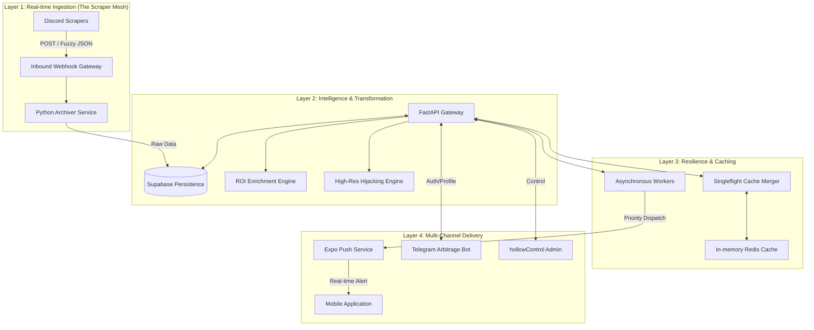

HollowScan is a distributed discovery ecosystem optimized for high-velocity marketplace arbitrage. The system bridges the gap between raw, unstructured marketplace signals (Discord, Webhooks) and actionable, high-fidelity consumer data. 

> [!NOTE]
> This document focus on the **Logic & Theory**. For the **Structural Blueprint & Infrastructure Topology**, see the [SYSTEM_ARCHITECTURE.md](./SYSTEM_ARCHITECTURE.md).

**Key Objectives:**
- **Zero Latency**: Sub-second deal ingestion to push notification delivery.
- **Cross-Platform Integrity**: Unified subscription status across iOS, Android, and Telegram.
- **Resilient Scalability**: Handling 10,000+ marketplace updates daily without database degradation.
- **Visual Fidelity**: Providing high-resolution imagery via source-transform "hijacking."

---

## 2. Distributed Layered Architecture

The HollowScan ecosystem is partitioned into four primary layers to ensure high availability and isolation of concerns.

---

## 3. Tier 1: Ingestion Pipeline & Scale
HollowScan is designed to ingest **10,000+ marketplace items daily**.

### 3.1 Multithreaded Archiver Logic
The **Python Archiver Service** operates as a non-blocking ingestion node. 
- **Batch Processing**: Instead of single-row inserts, the archiver buffers incoming webhooks and performs **SQL Batch Upserts** to minimize DB transaction overhead.
- **Deduplication Strategy**: Every deal is hashed via a `content_signature` (SHA-256 of Title + Description + URL). The database utilizes `ON CONFLICT DO NOTHING` to prevent feed pollution from duplicate restock notices.

### 3.2 Security Hardening: Scraper Detection & Rate Limiting
To maintain 100% uptime against retailer defenses:
- **Rotational Headers**: The Archiver utilizes dynamic User-Agent and Header rotating to mimic diverse organic traffic.
- **Rate-Limit Jitter**: Ingestion intervals are randomized with controlled jitter (±150ms) to bypass retail-side anti-bot heuristics.
- **Resolution Hijacking**: Bypassing retailer resolution limits (Amazon/eBay) by stripping size-limiting URL parameters (`.SL160.`, `.s-l300.`), delivering 4K product visuals to the end-user.

---

## 4. Tier 2: The Persistence Layer (Supabase)
The database architecture is optimized for real-time querying and cross-device sync.

### 4.1 Relational Data Model
- **`users`**: UUID-indexed master table handling Auth and High-level status.
- **`user_telegram_links`**: Many-to-One mapping of Telegram IDs to UUIDs.
- **`alerts`**: High-concurrency JSONB table containing raw marketplace blobs and enriched metadata.
- **`saved_deals`**: Atomic bookmarking system for offline availability.

### 4.2 Caching Strategy & Singleflight
To handle 1,000+ concurrent requests during peak deal drops:
- **Singleflight Merger**: The API identifies identical concurrent requests and initiates only **one** DB fetch, fulfilling all pending requests with a single result.
- **Cache TTL**: High-velocity deals are cached for 30s-60s to maintain up-to-the-second accuracy.

---

## 5. Tier 3: The Payment State Machine (IAP)
HollowScan implements a hardened, zero-fail subscription architecture.

### 5.1 The "iOS Plunger" Logic
The #1 failure in mobile revenue is the "Stuck Payment Queue." 
- **Mechanism**: On every app launch, the system audits the `SKPaymentQueue`.
- **Action**: If stuck transactions (Receipts not yet verified) are found, the system "plunges" them—sending them to the backend for verification and explicitly calling `finishTransaction()` to clear the bricked queue.

### 5.2 Server-to-Server (S2S) Webhooks
Premium status is managed via **Idempotent Webhooks**.
- **Real-time Sync**: Apple/Google dispatch `DID_RENEW` or `EXPIRED` notifications directly to the backend.
- **Consistency**: Status is updated in Supabase before the user even re-opens the app.

---

## 6. Infrastructure Resilience: The PDS Logic
HollowScan avoids container crashes through the **Patience Database Startup (PDS)** pattern.
- **Cold Boot Handling**: On server launch, the `lifespan` manager pings the Database iteratively for 90 seconds. 
- **Benefit**: This allows external services (Supabase/Redis) to initialize without causing the application layer to fail-stop.

---

## 7. Scalability Roadmap
- **Sharding**: Future partitioning of `alerts` table by `country_code` for faster region-specific discovery.
- **AI Scoring**: Predictive model to score deal "sell-out" velocity based on ingestion patterns.
