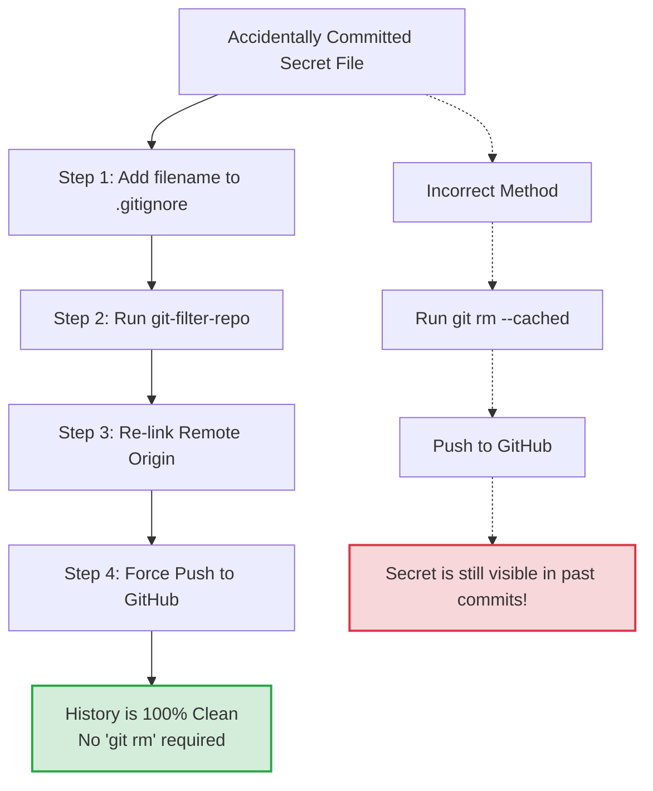

# How to Scrub Sensitive Files from Git History

If you ever accidentally commit a sensitive file (like an API key, `.env` file, or Service Account JSON) to your Git repository, simply untracking it with `git rm --cached <file>` is **not enough**. The file will still be visible in the Git history of previous commits.

To completely eradicate a file from the repository's entire timeline, we use `git-filter-repo`.

## The Conceptual Difference: `git rm --cached` vs `git-filter-repo`

Many developers mistakenly believe that `git rm --cached <file>` is enough to hide a sensitive file. It is not. 

*   **`git rm --cached`**: This command only tells Git to *stop tracking* the file in the **next** commit. It leaves the file perfectly visible in plain text in all past commits. If you push this to GitHub, anyone can look at your commit history from yesterday and steal the key.
*   **`git-filter-repo`**: This acts as a time machine. It scans your entire repository from the very first commit to the present day, finds every instance where that file ever existed, and completely rips it out. It rewrites the entire timeline so the file mathematically *never existed*. 

Because `git-filter-repo` actively rips the file out of your current commit natively during its operation, **you do not need to run `git rm --cached` beforehand.** 

However, because the physical file is still sitting on your laptop's hard drive, Git will think it's a brand new file you just created and will try to track it again. **You must add the filename to `.gitignore` immediately to prevent tracking it again.**

### The Correct Workflow


---

## 1. Prerequisites
You must have Python installed. Install the `git-filter-repo` tool globally via pip:

```bash
pip install git-filter-repo
```

## 2. Execute the Scrub
Run the following command for **every single file** you want to completely erase from the Git history. 

*Note: Because we are running this inside an existing, active repository (and not a fresh, bare clone), we must append the `--force` flag. This will rewrite the local `.git` folder.*

```bash
python -m git_filter_repo --invert-paths --path <exact_filename.ext> --force
```

### Example Commands Used for HollowScan:
```bash
python -m git_filter_repo --invert-paths --path hollowscan-1b311-firebase-adminsdk-fbsvc-740e1b1986.json --force
python -m git_filter_repo --invert-paths --path AuthKey_KJY2TRV893.p8 --force
python -m git_filter_repo --invert-paths --path GoogleService-Info.plist --force
python -m git_filter_repo --invert-paths --path glossy-metric-455008-p1-55180b5daaf8.json --force
python -m git_filter_repo --invert-paths --path eas.json --force

# run this first to avoid loosing the files from local pc
git rm --cached eas.json google-services.json
# multiple files at once
python -m git_filter_repo --invert-paths --path eas.json --path google-services.json --force
```

## 3. Re-link to GitHub (Origin)
As a safety mechanism, `git-filter-repo` will intentionally sever the connection to the remote repository (GitHub) once it alters the history. You must add the remote URL back:

```bash
git remote add origin https://github.com/joshuatochinwachi/HollowScan-Mobile-App.git
```

## 4. Overwrite the Cloud History
Your local repository is now clean, but GitHub still has the old history with the keys exposed. 

You must **Force Push** your local timeline to the cloud to overwrite the public/remote history permanently.

```bash
git push origin main --force
```

---
**CRITICAL SECURITY NOTE:**
While scrubing the Git history works, if your repository was public or compromised, bots may have already scraped the keys before you deleted them. The **only 100% secure method** is to go to the provider (Firebase, Apple, AWS, etc.) and permanently revoke/delete the compromised keys, generating new ones.
