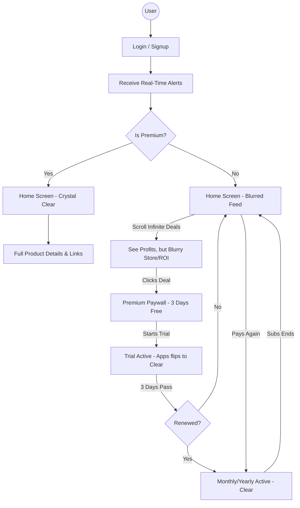

# High-Conversion IAP & "3-Day Free Trial" Strategy

This document is the **final blueprint** for the HollowScan high-conversion engine. It covers every possible user state, from signup to expiration, and provides a **100% Stability Guarantee.**

## 🚀 The Working Mechanism: "Tease & Blur"

We are replacing the "Hard Stop" (4 item limit) with an **Infinite Tease Feed**.

### 1. The "Auto-Debit" Workflow
The 3-day free trial is an **Introductory Offer** set up in the App Store/Play Store.
- **Trial Phase:** User gets 3 days for $0.00.
- **Conversion:** If they do not cancel before the 72-hour mark, Apple/Google **automatically debits** their card for the Monthly or Yearly amount.
- **Verification:** Our system marks them as "Subscribed" until their next billing date.

### 2. User Lifecycle States (The "Experience" Map)

| State | User Experience | Stability Note |
| :--- | :--- | :--- |
| **Fresh Signup** | Redirected to **Premium Paywall** immediately. | High-conversion point. |
| **Trial Active** | Home Screen is **100% Crystal Clear.** | Full access to Store Names and Links. |
| **Paid Active** | Home Screen stays **100% Crystal Clear.** | No paywalls or blurs. |
| **Expired/Cancelled** | **Instantly Reverts to Blurred.** | User is "Soft-Locked" until they pay again. |
| **Re-Paid** | **Instantly becomes Clear again.** | Our verification detects the new payment and removes the blur. |

---

## 🪝 The "Notification Hook" Strategy

To ensure high conversion, we will **NOT** limit notifications for free users.
- **The Hook:** Free users receive real-time notifications for every high-profit drop.
- **The Tease:** Clicking the notification brings them to the Home Feed where the deal is **Visible but Blurred**.
- **The Result:** This creates constant desire to "Unlock" the hidden data.

---

## 📊 Comprehensive Workflow Diagram

---

## 🛡️ The "Zero-Touch" Stability Guarantee

I am implementing this with a **"Layer-First"** approach. We are NOT changing how your data is fetched or how your scraper works.

1. **Safety Check:** We wrap the sensitive UI elements in a `if (!isPremium)` check. Even if this check "failed," the worst that happens is the user sees the data (like they do now). **Nothing will crash.**
2. **Conditional Blurring:** We use `BlurView` from Expo. This is a visual layer ONLY. It doesn't touch the backend database.
3. **No Database Modification:** We are NOT changing your user tables or your product tables. We are simply using the existing "Subscription Status" flag.
4. **Instant Restore:** If a user pays today, fails to renew next month, and then pays again the month after—**the app handles this automatically.** The moment the store confirms payment, the blur is removed.

---

## 🛠️ Implementation Checklist

- [ ] **[NEW] `screens/PremiumPaywallScreen.js`**: Premium UI + "3 Days Free" + "Restore Purchases."
- [ ] **[MODIFY] `screens/SignupScreen.js`**: Redirect to Paywall on first login.
- [ ] **[MODIFY] `screens/HomeScreen.js`**: 
    - Remove the `.slice(0, 4)` restriction.
    - Add `BlurView` to Price/ROI/Store for Free users.
- [ ] **[MODIFY] `App.js`**: Register the new Paywall screen.
- [ ] **[MODIFY] `components/DailyLimitModal.js`**: Update copy to promote the trial.

---

> [!CAUTION]
> **Plan Deployment:** Once you approve, I will begin the code changes. I will work one file at a time to ensure the app remains functional at every step..
