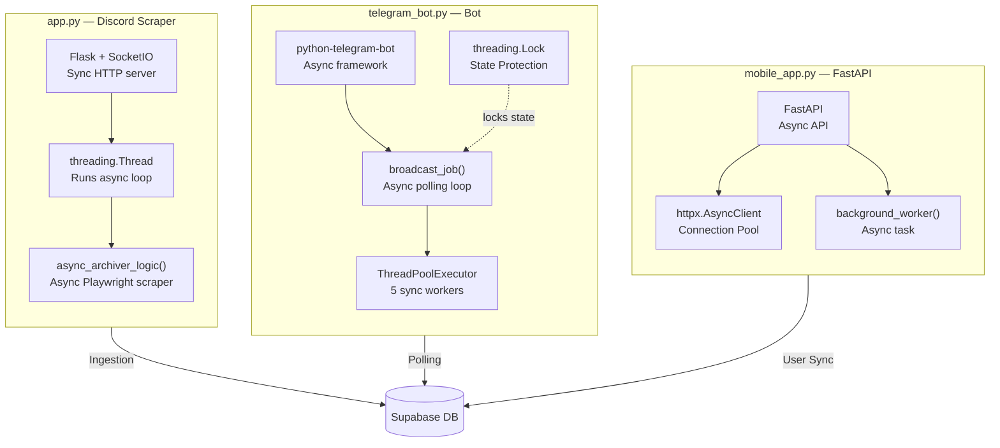
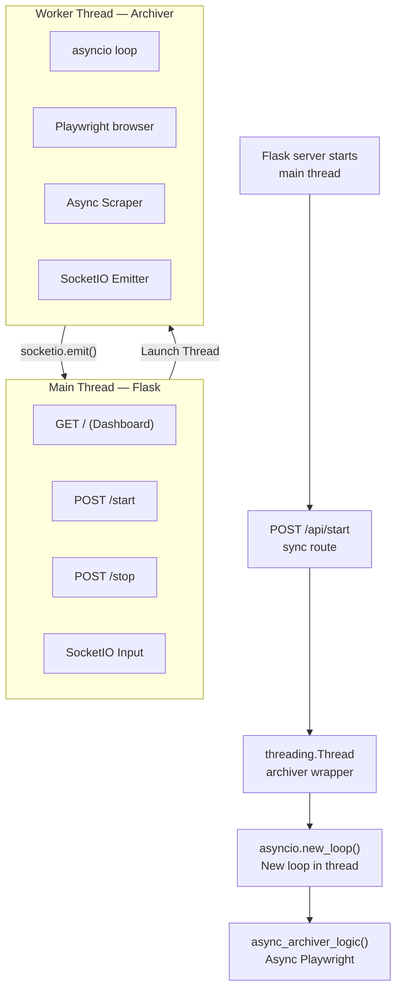
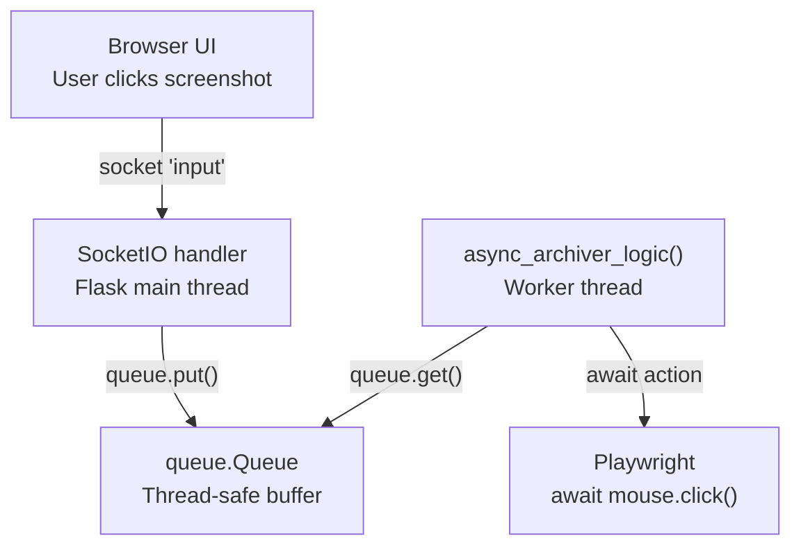
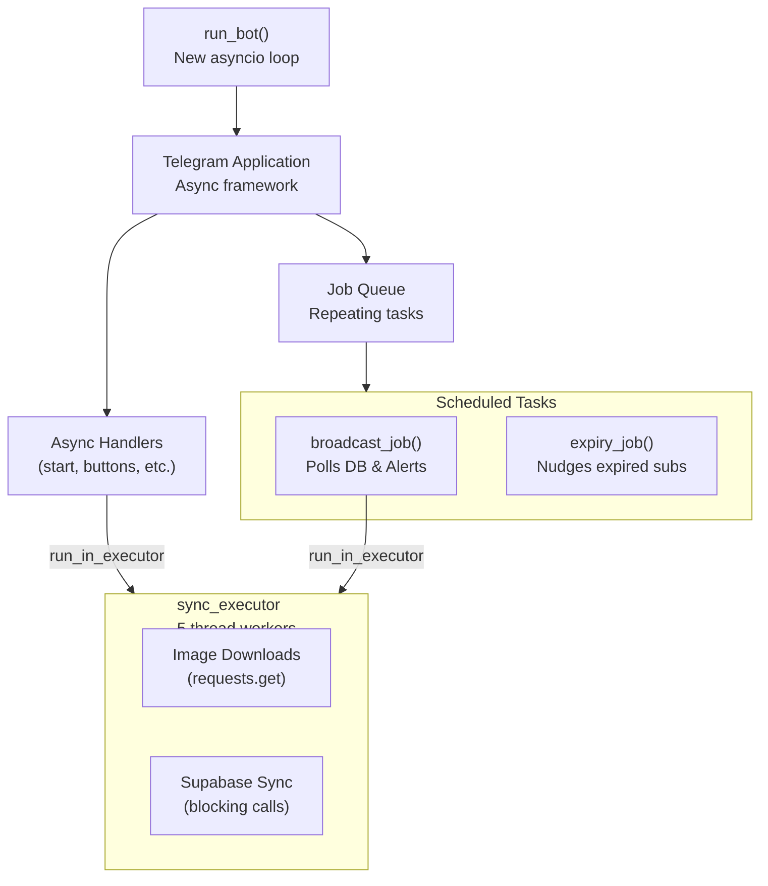
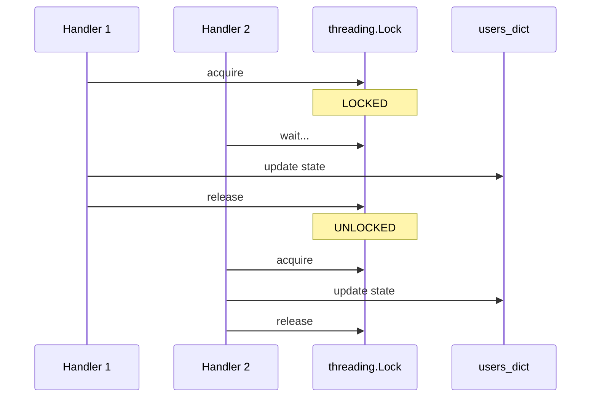
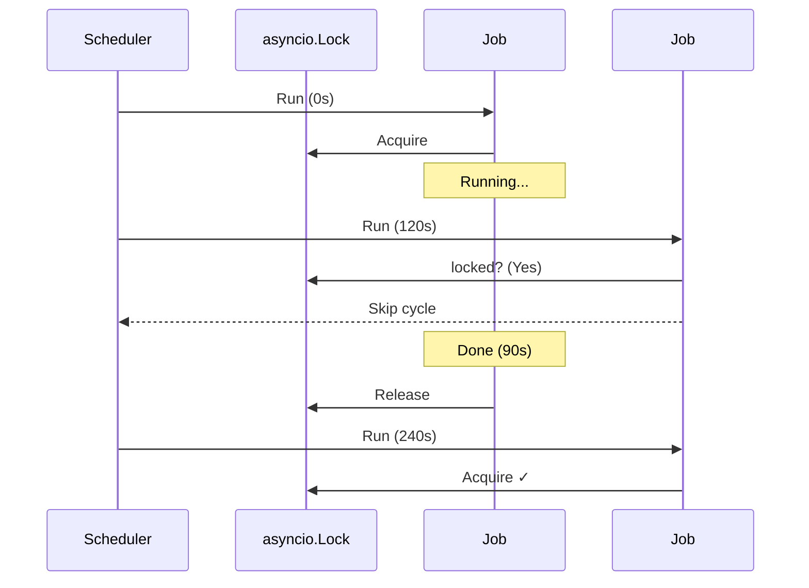
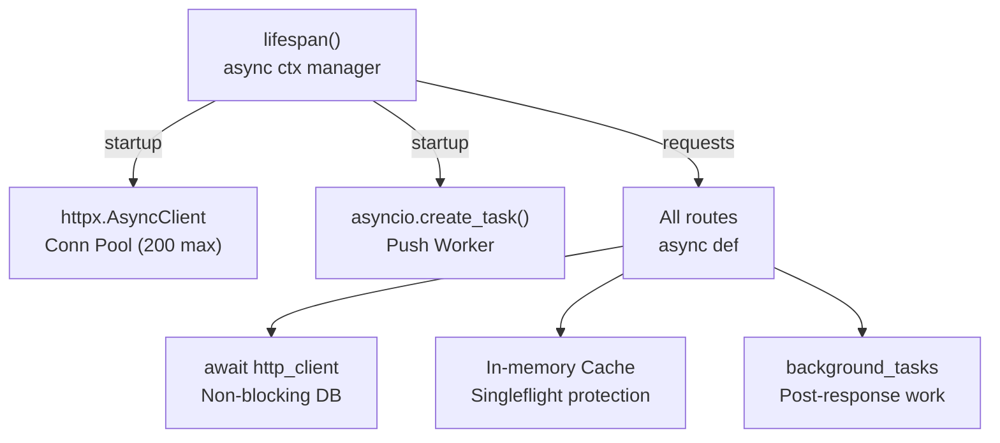
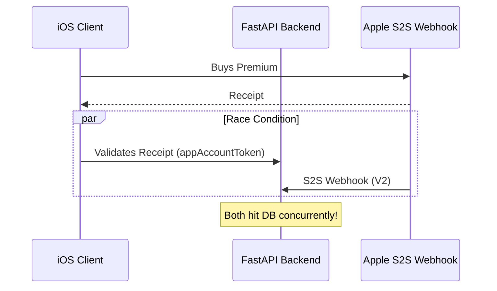
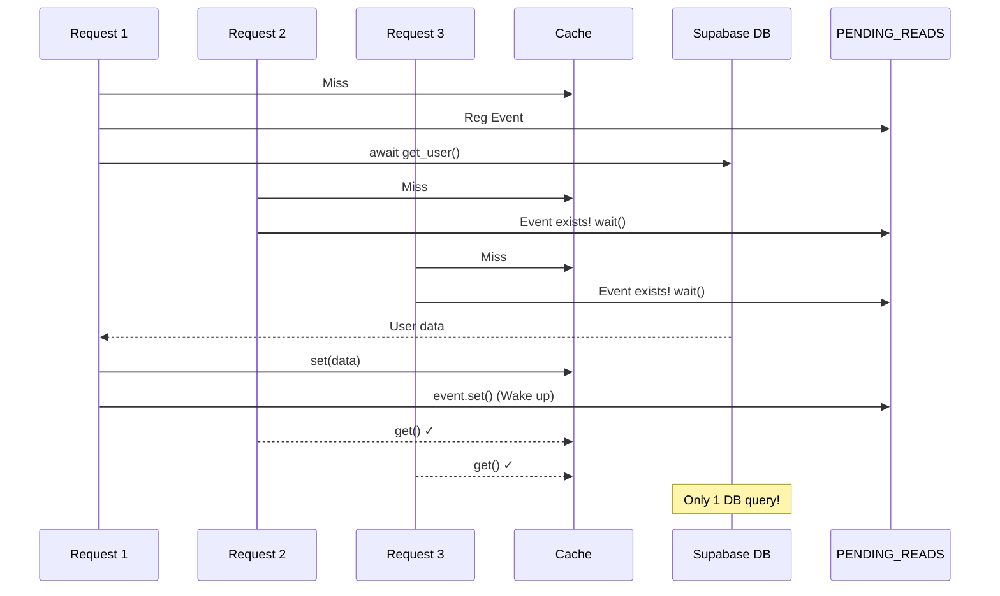
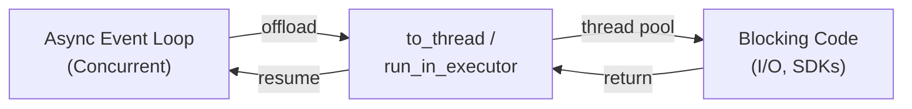

# Concurrency in the HollowScan Backend
### Async, Sync, and Multithreading Across All Three Services

> **Project:** HollowScan — Discord Scraper + Telegram Bot + FAST API Backend
> **Website:** [hollowscan.com](https://www.hollowscan.com)

---

## Overview — Three Services, Three Different Architectures

The HollowScan backend is three separate Python services working together:



---

## Part 1 — `app.py` (Discord Scraper / Stealth Archiver)

### The Architecture: Sync + Async + Threading, All Three at Once

This file has the most complex concurrency of the three. It mixes Flask (synchronous), Playwright (async), and Python threads to bridge the two worlds.



---

### Sync Functions in `app.py`

These are regular `def` functions — no async, no threads. They run in the calling thread:

```python
# All of these are sync — they just do quick work and return

def log(message):                    # Appends to list, emits socket event
def send_telegram_alert(...)         # HTTP POST via requests (blocking)
def set_status(status):              # Updates dict, emits event
def clean_text(text):                # String manipulation
def save_channel_metrics():          # JSON write + Supabase upload
def load_channel_metrics():          # Supabase download + JSON read
def get_small_batch_channels(...):   # Math + dict operations
def get_next_check_interval():       # Random number generation
def track_channel_error(...):        # Dict update + sends Telegram alert
def track_channel_success(...):      # Dict update
def generate_content_hash(...):      # MD5 hash
def get_realistic_user_agent():      # Returns random string
def ensure_browsers_installed():     # subprocess.run() — blocking!
```

**Important note about `send_telegram_alert`:** This uses `requests.post()` which is a **blocking HTTP call**. It's called from inside the async archiver. This is a hidden blocking call that freezes the async loop when an alert fires. It should use `aiohttp` or `run_in_executor` instead.

---

### Async Functions in `app.py` (The Stealth Archiver)

Everything that runs inside the Playwright browser session is async. This forms the core of the "Stealth Archiver", using Gaussian delays and heuristics to evade bot detection:

```python
async def smart_delay(base_min, base_max)        # await asyncio.sleep()
async def random_typing_delay()                  # await asyncio.sleep()
async def simulate_human_pause()                 # await asyncio.sleep()
async def advanced_mouse_movement(page)          # await page.mouse.move()
async def realistic_scroll_behavior(page)        # await page.evaluate()
async def simulate_reading_pattern(page)         # await asyncio.sleep()
async def take_idle_break()                      # Long chunked sleep loop
async def take_long_sleep()                      # Very long sleep
async def navigate_to_channel(page, url)         # await page.goto(), click()
async def expand_collapsed_categories(page)      # await page.locator()
async def extract_embed_data(message_element)    # await embed.inner_text()
async def extract_message_author(message_element)# await element.count()
async def wait_for_messages_to_load(page)        # await page.wait_for_selector()
async def async_archiver_logic()                 # The main loop — everything
```

---

### Multithreading in `app.py`

There are **two** distinct uses of threads:

**Thread 1 — The Archiver Thread**

```python
def run_archiver_thread_wrapper():
    nest_asyncio.apply()
    loop = asyncio.new_event_loop()      # Create NEW event loop
    asyncio.set_event_loop(loop)
    loop.run_until_complete(async_archiver_logic())

# Called from the Flask route:
archiver_thread = threading.Thread(
    target=run_archiver_thread_wrapper,
    daemon=True
)
archiver_thread.start()
```

Why a thread? Flask runs synchronously. You can't `await` inside a Flask route. The solution is to launch a background thread that creates its own asyncio event loop and runs the entire async scraper inside it.

```mermaid
sequenceDiagram
    participant Flask as Flask Thread
    participant Thread as Worker Thread
    participant Loop as Async Loop
    participant PW as Playwright

    Flask->>Thread: Launch Thread
    Thread->>Loop: Create Loop
    Loop->>PW: __aenter__()
    Note over Loop,PW: Scraping Loop
    PW-->>Loop: Data/Images
    Loop-->>Flask: socketio.emit()
```

**Thread 2 — Supabase uploads (fire-and-forget)**

```python
# Inside save_channel_metrics():
threading.Thread(
    target=supabase_utils.upload_file,
    args=(local_path, SUPABASE_BUCKET, remote_path)
).start()
```

This is a "fire and forget" thread — the function starts a background upload and immediately returns without waiting. No result is needed, so it doesn't block the caller.

**Thread coordination — `thread_lock` and `stop_event`**

```python
thread_lock = threading.Lock()   # Prevents two archiver threads starting simultaneously
stop_event = threading.Event()   # Signal to tell the archiver to stop

# In /api/start:
with thread_lock:
    if archiver_thread and archiver_thread.is_alive():
        return jsonify({"status": "already_running"}), 409
    stop_event.clear()
    archiver_thread = threading.Thread(...)
    archiver_thread.start()

# In /api/stop:
stop_event.set()  # Signal the archiver loop to stop

# Inside the archiver loop, checked every iteration:
if stop_event.is_set(): break
```

This is a classic producer-consumer thread coordination pattern. `threading.Lock` prevents race conditions on the `archiver_thread` variable. `threading.Event` is a lightweight cross-thread signal.

**Weighted Channel Selection & Sampling**

To optimize infrastructure load, the archiver doesn't visit every channel at the same frequency. It implements a **Weighted Channel Selection** strategy:
- **High-Signal Channels**: Checked every 2-5 minutes (High weight).
- **Low-Activity Channels**: Sampled every 20-30 minutes (Low weight).
- **Dynamic Re-weighting**: If a channel drops a deal, its weight is temporarily boosted to catch follow-up restocks.

This ensures the archiver is always where the "action" is without needing to run 100+ concurrent browser instances.

---

### Distributed Ingestion Coordination

Since HollowScan runs on a multi-node cluster, we must prevent two nodes from scraping and alerting for the same message.

```python
def generate_content_hash(msg_text, author_id):
    # MD5 hash of unique message components
    return hashlib.md5(f"{msg_text}{author_id}".encode()).hexdigest()
```

Before any node broadcasts an alert, it checks the **Content Signature** against Supabase. This creates a distributed lock at the data layer, ensuring that even with multiple concurrent scrapers, the user only receives **exactly one notification** per deal.

---

### The `input_queue` — Thread-Safe Communication

```python
input_queue = queue.Queue()  # Thread-safe FIFO queue

# SocketIO handler (Flask/main thread) PUTS items in:
@socketio.on('input')
def handle_input(data):
    input_queue.put(data)

# Async archiver (worker thread) GETS items out:
while not input_queue.empty():
    act = input_queue.get_nowait()
    await page.mouse.move(...)
```

`queue.Queue` is Python's thread-safe data structure. It allows the Flask thread and the archiver thread to communicate without race conditions — the live browser control (mouse clicks, keypresses from the web UI) travels through this queue.



---

## Part 2 — `telegram_bot.py` (Telegram Bot)

### The Architecture: Fully Async + Threads for Sync I/O



---

### Sync Functions in `telegram_bot.py`

The vast majority of utility and data-manipulation functions are sync:

```python
# Utilities
def parse_iso_datetime(iso_string)       # Date parsing
def extract_markdown_links(text)         # Regex
def categorize_links(links)              # Dict classification
def optimize_image_url(url)              # String manipulation
def is_high_quality_image(url)           # URL analysis
def add_emoji_to_link_text(text)         # String manipulation
def parse_tag_line(tag)                  # String parsing
def clean_text(text)                     # Regex cleanup
def format_price_value(value)            # Price formatting
def _format_collectors_amazon(...)       # Message formatter
def _format_argos(...)                   # Message formatter
def _format_restocks_currys(...)         # Message formatter
def is_duplicate_source(msg_data)        # Filter check
def is_restock_filter_match(msg_data)    # Filter check
def create_main_menu(user_id)            # Keyboard builder

# Blocking I/O (should be in executor but isn't ⚠️)
def fetch_product_images(url)            # requests.get() — BLOCKING
def download_image_high_quality(url)     # requests.get() — BLOCKING
```

**Critical note:** `fetch_product_images()` and `download_image_high_quality()` use `requests.get()` which is synchronous and blocking. However, they ARE correctly pushed to a thread via `run_in_executor` at the call sites in `test_alerts()` and `_broadcast_job_inner()`. This is the right pattern.

---

### The `SubscriptionManager` — Threading for Shared State

`SubscriptionManager` is accessed by both the Telegram bot (async context) and potentially concurrent webhook calls. It uses `threading.Lock` to protect the shared `self.users` dictionary:

```python
class SubscriptionManager:
    def __init__(self):
        self.lock = threading.Lock()  # Protects self.users dict

    def toggle_pause(self, user_id: str) -> bool:
        with self.lock:           # Acquire lock
            current = self.users[str(user_id)].get("alerts_paused", False)
            self.users[str(user_id)]["alerts_paused"] = not current
            self._sync_state()
            return not current
        # Lock automatically released here
```



Without this lock, two concurrent handlers modifying `self.users` simultaneously could corrupt the dictionary — a classic race condition.

---

### Async Functions in `telegram_bot.py`

All command handlers and the broadcast system are async:

```python
# Command handlers
async def start(update, context)
async def subscribe(update, context)
async def button_handler(update, context)
async def handle_message(update, context)
async def gen_code(update, context)
async def test_alerts(update, context)
async def broadcast_job(context)           # Scheduled — runs every 120s
async def _broadcast_job_inner(context)    # Actual broadcast logic
async def expiry_reminder_job(context)
async def potential_user_reminder_job(context)

# Telegram linking
async def handle_link(update, context)
async def handle_unlink(update, context)

# Admin
async def notify_admins(context, text)
async def setup_bot_commands(context)
```

---

### The `broadcast_job` — Async Lock for Overlap Prevention

```python
broadcast_lock = asyncio.Lock()  # asyncio lock — NOT threading.Lock

async def broadcast_job(context):
    if broadcast_lock.locked():
        logger.warning("Previous broadcast job still running — SKIPPING")
        return
    
    async with broadcast_lock:
        await asyncio.wait_for(
            _broadcast_job_inner(context),
            timeout=MAX_JOB_RUNTIME  # 110 seconds hard limit
        )
```

This is different from `threading.Lock`. `asyncio.Lock` works within a single thread's event loop — it prevents two coroutines from running the same code concurrently, even though they're in the same thread. The job runs every 120 seconds but can take up to 110 seconds. Without this lock, a slow broadcast could still be running when the next one starts, sending duplicate messages to all users.



---

### `ThreadPoolExecutor` for Blocking I/O

```python
sync_executor = ThreadPoolExecutor(max_workers=5, thread_name_prefix="sync_io")

# Used in test_alerts() and _broadcast_job_inner():
loop = asyncio.get_event_loop()
downloaded = await loop.run_in_executor(
    sync_executor,              # Use our named pool (not default)
    download_image_high_quality, # The blocking function (High-Res Image Hijacking)
    image_url                    # Its argument
)
```

Using a **named** executor (`sync_executor`) rather than the default `None` is a deliberate choice — it limits the number of concurrent "High-Res Image Hijacking" downloads to 5, preventing the bot from opening hundreds of HTTP connections simultaneously when broadcasting to many users.

---

### `asyncio.to_thread()` — The Modern Alternative

In the linking handlers, a newer pattern is used:

```python
async def handle_link(update, context):
    success = await asyncio.to_thread(
        supabase_utils.store_telegram_link_token,
        token,
        user_id
    )
```

`asyncio.to_thread()` is equivalent to `loop.run_in_executor(None, fn, *args)` but cleaner syntax. It runs a blocking function in the default thread pool. Both patterns do the same thing — push blocking work to a thread so the event loop stays free.

---

### `run_bot()` — Threading the Event Loop

```python
def run_bot():
    loop = asyncio.new_event_loop()  # Fresh loop
    asyncio.set_event_loop(loop)
    app = Application.builder().token(TELEGRAM_TOKEN).build()
    # ...register handlers...
    app.run_polling(stop_signals=[])  # stop_signals=[] is critical!
```

`stop_signals=[]` is required because `run_bot()` is called from a thread (in `app.py`'s main block). OS signals like SIGTERM can only be handled on the main thread. If `run_polling` tried to register signal handlers from a background thread, it would crash with `ValueError: signal only works in main thread`.

---

## Part 3 — Mobile API (`app.py` FastAPI Backend)

### The Architecture: Fully Async with One Background Task



---

### Sync Functions in the Mobile API

Very few sync functions — the codebase is almost entirely async:

```python
def safe_parse_dt(dt_str)           # Datetime parsing
def optimize_image_url(url)         # String manipulation (+ @lru_cache)
def _clean_text_for_sig(text)       # Regex
def _get_content_signature(msg)     # Hashing
def _clean_display_text(text)       # Regex
def _parse_price_to_float(price)    # Number parsing
def hash_password(password)         # SHA256
def generate_verification_code()    # Random digits
```

`@lru_cache(maxsize=1024)` on `optimize_image_url` means the first call computes the result and caches it — subsequent calls with the same URL return instantly without re-running the logic. This is a simple form of memoization (not concurrency-related but worth knowing).

---

### Async Functions in the Mobile API

Everything that touches the network or database is async:

```python
# DB helpers
async def get_user_by_id(user_id)
async def get_user_by_email(email)
async def update_user(user_id, data)
async def delete_user_by_email(email)
async def verify_premium_status(user_id, ...)
async def link_telegram_account(user_id, ...)
async def send_email_via_resend(to_email, ...)
async def trigger_email_verification(email, ...)
async def get_bot_users_data()

# Background worker
async def background_notification_worker()  # Runs forever

# All 40+ routes
async def signup(...)
async def login(...)
async def get_feed(...)
async def get_user_status(...)
# ...and so on
```

---

### `httpx.AsyncClient` — Why Not `requests`?

The mobile API uses `httpx` instead of `requests` for all HTTP calls:

```python
# Created once at startup, reused for ALL requests
http_client = httpx.AsyncClient(
    limits=httpx.Limits(
        max_keepalive_connections=50,
        max_connections=200
    ),
    timeout=httpx.Timeout(60.0, connect=30.0)
)
```

`requests` is synchronous — using it in an async FastAPI app would block the event loop on every DB call (same problem as the Dune SDK in the other API). `httpx.AsyncClient` supports `await`, so DB calls are non-blocking. Creating ONE client and reusing it (connection pooling) is far more efficient than creating a new connection per request.

---

### PDS (Patience Database Startup) Logic

```python
@asynccontextmanager
async def lifespan(app: FastAPI):
    # PDS Loop: Wait for DB to be ready before accepting traffic
    for i in range(5):
        try:
            # Attempt DB ping
            break
        except Exception:
            await asyncio.sleep(2 ** i)  # Exponential backoff
    
    http_client = httpx.AsyncClient(...)
    asyncio.create_task(background_notification_worker())
    yield
    await http_client.aclose()
```

PDS (Patience Database Startup) prevents the FastAPI backend from entering a crash loop if the database is temporarily unreachable during a cold boot or auto-scaling event. The `lifespan` context manager runs *before* the application starts accepting HTTP requests, using `asyncio.sleep` to wait without blocking the thread, ensuring high availability.

---

### IAP Race Conditions & The "iOS Plunger"

When dealing with mobile In-App Purchases (IAP), a classic race condition exists: the mobile client might verify a purchase *before* or *after* the Apple Server-to-Server (S2S) webhook arrives.



To resolve this, the system uses **StoreKit 2 `appAccountToken`** to firmly link transactions to the user's UUID *before* the purchase. If a webhook arrives early or a receipt is stuck, an async background task known as the **"iOS Plunger"** periodically sweeps the pending transaction queue and reconciles it against the database. This "defense-in-depth" architecture ensures 100% subscription integrity across race conditions.

---

### The Singleflight Pattern — Cache Stampede Protection

```python
PENDING_READS: Dict[str, asyncio.Event] = {}

async def get_user_status(user_id):
    cache_key = f"user_status:{user_id}"
    
    # 1. Check cache
    cached = user_cache.get(cache_key)
    
    # 2. If another request is already fetching this key, WAIT for it
    if cached is None and cache_key in PENDING_READS:
        await PENDING_READS[cache_key].wait()  # Wait for the in-progress fetch
        cached = user_cache.get(cache_key)     # Now get the shared result
        return cached
    
    # 3. We're the first — register our event so others can wait
    event = asyncio.Event()
    PENDING_READS[cache_key] = event
    
    try:
        # Do the DB fetch
        result = await get_user_by_id(user_id)
        user_cache.set(cache_key, result)
        return result
    finally:
        event.set()                # Wake up all waiters
        del PENDING_READS[cache_key]
```



Without this pattern, 100 simultaneous requests for the same user's status would all hit the database simultaneously — a "cache stampede". The singleflight pattern ensures only one request does the work; all others wait and share the result.

---

### `BackgroundTasks` — FastAPI's Post-Response Execution

```python
@app.get("/v1/user/status")
async def get_user_status(background_tasks: BackgroundTasks, user_id: str):
    # ... fetch user data ...
    
    # Schedule work to run AFTER the response is sent
    background_tasks.add_task(update_user, user_id, {
        "subscription_status": "active",
        "subscription_end": expiry_iso
    })
    
    return result  # Response sent to user immediately
    # update_user() runs after this
```

`BackgroundTasks` schedules work to happen after the HTTP response is already returned to the client. This is used for non-critical updates (like syncing premium status) where the user shouldn't have to wait. It's different from `asyncio.create_task()` — it's tied to the request lifecycle and guaranteed to run for that specific request.

---

### `background_notification_worker` — The Eternal Loop

```python
@asynccontextmanager
async def lifespan(app: FastAPI):
    http_client = httpx.AsyncClient(...)
    asyncio.create_task(background_notification_worker())  # Fire and forget
    yield
    await http_client.aclose()

async def background_notification_worker():
    while True:
        try:
            await asyncio.sleep(30)         # Check every 30 seconds
            messages = await fetch_new_messages()
            for msg in messages:
                tokens = await get_user_tokens()
                await send_expo_push_notification(tokens, ...)
        except asyncio.CancelledError:
            break
        except Exception as e:
            await asyncio.sleep(60)         # Back off on error
```

`asyncio.create_task()` schedules the worker as a concurrent task running alongside all route handlers — the same event loop handles both. The `await asyncio.sleep(30)` yields control back to the event loop every 30 seconds so routes can still be served while the worker waits.

---

## Master Comparison Table

| Function / Pattern | File | Type | Why |
|---|---|---|---|
| `async_archiver_logic()` | scraper | **Async** | Playwright requires async |
| `run_archiver_thread_wrapper()` | scraper | **Thread** | Bridges sync Flask to async Playwright |
| `send_telegram_alert()` | scraper | **Sync ⚠️** | Uses `requests` — blocks async loop |
| `save_channel_metrics()` | scraper | **Sync** | Fast JSON write |
| `threading.Thread(upload_file)` | scraper | **Thread** | Fire-and-forget Supabase upload |
| `input_queue` | scraper | **Thread-safe Queue** | Cross-thread mouse/keyboard events |
| `thread_lock` | scraper | **threading.Lock** | Prevents duplicate archiver threads |
| `stop_event` | scraper | **threading.Event** | Signals archiver to stop |
| `broadcast_job()` | bot | **Async** | Polls DB and sends Telegrams |
| `broadcast_lock` | bot | **asyncio.Lock** | Prevents overlapping broadcasts |
| `sm.toggle_pause()` | bot | **Sync + threading.Lock** | Protects shared users dict |
| `download_image_high_quality()` | bot | **Sync** | Blocking requests.get() |
| `run_in_executor(sync_executor, ...)` | bot | **Thread** | Pushes image download to thread |
| `asyncio.to_thread(...)` | bot | **Thread** | Modern run_in_executor syntax |
| `run_bot()` | bot | **Thread-hosted event loop** | Called from background thread |
| `stop_signals=[]` | bot | **Thread safety** | Prevents signal handler crash in thread |
| All route handlers | mobile API | **Async** | FastAPI is async-native |
| `httpx.AsyncClient` | mobile API | **Async** | Non-blocking HTTP/DB calls |
| `background_notification_worker()` | mobile API | **Async** | `asyncio.create_task()` — eternal loop |
| `BackgroundTasks.add_task()` | mobile API | **Async** | Post-response non-critical work |
| `PENDING_READS` singleflight | mobile API | **Async** | Prevents cache stampede |
| `@lru_cache` on `optimize_image_url` | mobile API | **Sync** | Memoization — not concurrency |
| `@db_retry` decorator | mobile API | **Async** | Retry logic for transient DB errors |
| `PDS Loop` | mobile API | **Async Backoff** | Prevents crash loops on cold boot |
| `iOS Plunger` | mobile API | **Async Worker** | Reconciles IAP race conditions |
| `Content Hashing` | scraper | **Distributed Lock** | Prevents duplicate alerts in cluster |
| `Weighted Sampling` | scraper | **Priority Logic** | Optimizes infra load vs deal discovery |

---

## The One Shared Pattern Across All Three

Every service uses the same bridge between blocking code and async:



The pattern appears in all three files under different names but does the same thing: async code offloads blocking work to threads so the event loop stays free to handle other tasks. This is the fundamental pattern behind all three services working together without freezing.
