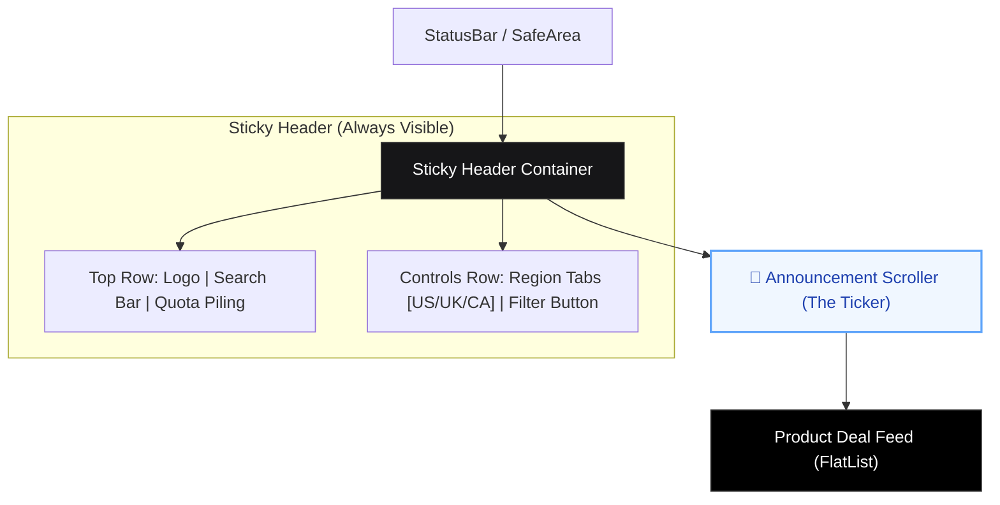

# Home Screen Layout Diagram

This diagram illustrate how the new **Announcement Scroller** is professionally integrated into the HollowScan Home Page without disrupting existing elements.

### Positioning Details:
1.  **Fixed-to-Top Area:** The Scroller is placed exactly between your navigation controls and the actual deal data. This ensures it's the first thing users see, but it doesn't block the search bar.
2.  **Visual Separation:** It uses a subtle background tint (Blue/Slate) to differentiate it from the main app background, creating a professional "News Ticker" look.
3.  **Adaptive Height:** When the `APP_ANNOUNCEMENT` is empty, the scroller completely collapses (Height: 0), ensuring no wasted space.
