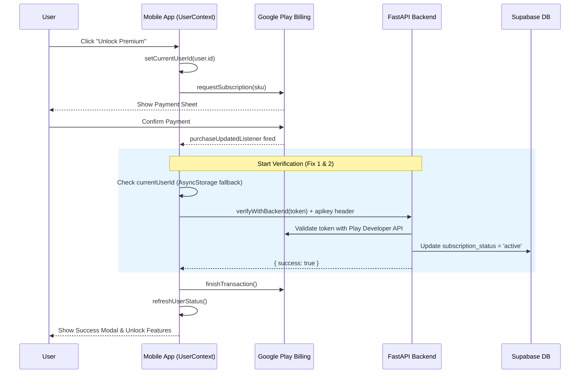
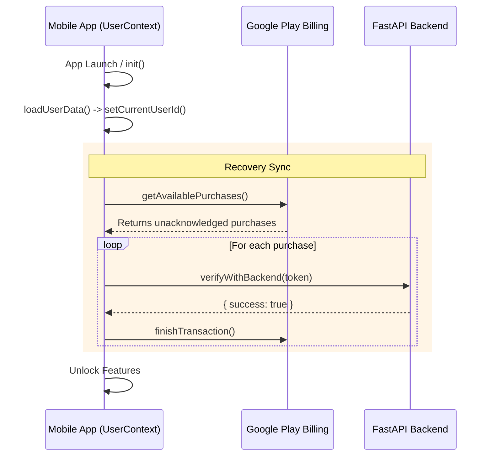

# HollowScan IAP Payment & Recovery Workflow

This chart illustrates the end-to-end process for a successful purchase and the automatic recovery of interrupted payments.

## 1. Successful Purchase Flow

## 2. Startup Recovery Flow (Fix 3)
*Handles purchases that were paid for but the app/server crashed before verification.*

## Diagnostic Final Verdict: READY ✅
The system is now structurally reinforced for production. The combination of **Authenticated Headers**, **Race Condition Safety Nets**, and **Startup Recovery** ensures no payment token is ever lost or ignored.
